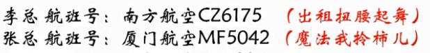
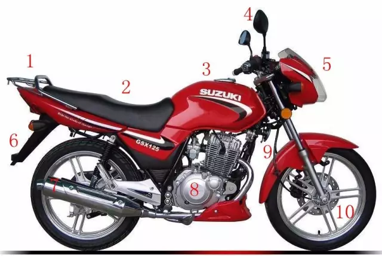
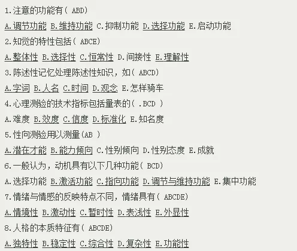

# 30天记忆训练体系


# A01 中文人名

```
下面是1955年授予的中国人民解放军十大将军，请将你不熟悉的人名，用形象转化的方式记忆下来.。

（1）陈赓

（2）粟裕

（3）罗瑞卿

（4）张云逸

（5）许光达

（6）徐海东

（7）肖劲光

（8）黄克诚

（9）谭政

（10）王树声
```

**鞋子拆观众**


[视频](https://v.qq.com/x/page/y055877ho7i.html)

拆字的时候注意某些字不要太抽象，应该用 **物体**。


呜呜的火车（55年）拉着十大元帅，他们在用`陈`醋洗澡，洗完后把醋达到了一科榆树（`粟裕`）的根（`赓`）上，数死了，啪的一声死亡了(亡树生 - `王树声`)。树倒了，肖峰跑过来把树削清光（`肖劲光`），把他切成一片一片，用罗(`罗瑞卿`)和美女董`卿`两个人挑到市场买，一元一张（`张云逸`），然后赚到了很多钱去赌场，结果输光了（`许光达`），只要又去东海(`徐海东`)，结果路上遇到了林则`徐`，二个人就谈起了政治（`谭政`），准备用`黄`金万两和100`克`拉的砖石去攻城（`诚`）


# A02 外国人名

希腊神话中的十二主神：

宙斯(Zeus)：克洛诺斯和瑞亚之子；掌管天界，是第三任神王；以贪花好色著名。

赫拉(Hera)：宙斯的姐姐和夫人，美丽的天后；婚姻的保护神，尤其是已婚的女人的保护者。

波塞冬(Poseidon)：宙斯的兄弟；掌管大海；脾气暴躁，贪婪。

哈底斯(Hades)：宙斯的兄弟；掌管冥府，同时也是财富之神；有一顶可以隐身的帽子；残忍，可怕，但很守信。

德墨忒耳(Demeter)：克洛诺斯和瑞亚之女，宙斯的姐姐；农业女神。

阿瑞斯(Ares)：宙斯与赫拉之子；战争之神；粗暴而嗜血，但并非真正的勇士。

雅典娜(Athena)：宙斯与美狄丝结合的产物；智慧女神和女战神；她是智慧，理智和纯洁的化身。

阿波罗(Apollo)：宙斯和勒托之子，和阿耳忒弥斯是双生兄妹；太阳神。

阿佛洛狄忒(Aphrodite)：爱，美和欲望之神；从海中的泡沫中生出。

赫尔墨斯(Hermes)：宙斯和迈亚之子；众神中最快者；盗窃者的守护神，商业之神，黄泉的引导者。

阿耳忒弥斯(Artemis)：宙斯和勒托之女，与阿波罗是双生兄妹；美丽的女猎神和月神，青年人的保护神。

赫淮斯托斯(Hephaestus)：宙斯与赫拉之子，神中唯一丑陋者，但老婆却是爱与美之神阿佛洛狄忒；火和锻造之神，为众神制造武器和铠甲；铁匠和织布工的保护神。


这里很多神的名字大家比较熟悉，好多我是通过动画片《圣斗士星矢》认识的，我挑选出6个相对陌生的，请你来记。

1、德墨忒耳

- 德国买的墨水也忒小了，都可以塞进耳朵里面，耳朵都黑了，可以写字了。

- 德国的模特儿耳朵都很大、漂亮

2、阿瑞斯

- 印度阿三带了瑞士手表以为很有钱，却是个司机

- 印度阿三去了瑞士

3、阿佛洛狄忒

- 阿三头定着佛，结果落地了，只能推着走

4、赫尔墨斯

- 陈赫耳朵打了摩丝，尖尖的像阿凡达。

```
hull : 赫尔

n. 船体；（果实的）外壳
vt. [粮食] 去壳
```

5、阿耳忒弥斯

阿凡达的耳朵里面有个特务放了拉了很多米一样的屎

6、赫淮斯托斯

陈赫怀里有只猫，把他的丝袜拉脱丝了。


[视频](https://v.qq.com/x/page/d0559xgcves.html)


不要使用抽象词，画面最好有结果。


# A03 地名记忆

最近看了一本书叫《牧羊少年奇幻之旅》，作者是一位巴西作家，主人公的名字叫圣地亚哥，这勾起了复习一下**南美洲**地理的欲望，下面是一些南美洲重要的一些名字，如果你是中学生，这可是考点哦，如果你已经工作，有机会一定去看看，世界这么大，怎能只记得名字？

请用形象转化的方式记忆下来，并且分享你的想法。


1、拉普拉塔河

- 一个吉普车拉着另外一个吉普车，把搭堆到到河面上过河。
- 拉布拉多狗

2、潘帕斯草原

- 潘玮柏很怕死，一身只敢住在草原，人都绿了
- 潘长江怕死不敢在草原骑马
- 潘：潘长江，潘金莲
- 帕：手帕

3、巴塔哥尼亚高原

- 爸爸在塔山和哥哥把泥做的鸭子扔高原上，鸭子得了高原反应，死了。
- 巴：巴士

4、圭亚那高原

- 乌龟托着一只鸭子来听那英的演唱会，那英声音太高，鸭子都飞走了。
- 亚：哑铃

5、德雷克海峡

- 德国的手雷很差劲，课本都炸不烂。
- 朱德开着雷克萨斯开过了台湾海峡。
- 朱德那了手雷，扔到坦克上炸飞了。

6、合恩角

- 和尚跪舔周恩来的脚。
- 合：百合，合同

[视频](https://v.qq.com/x/page/u0559yknu9a.html)


# A04 化学词语

1、丙二醇

- 盲炳拉着二胡，吃着木糖醇

2、脱氢乙酸钠

- 小青脱掉青色的衣服，喝着酸奶

3、硬脂酸钾

- 

4、黄原胶

5、麦芽糖淀粉酶

6、聚甘油脂肪酸酯

- 甘油酯 - 干柚子
- 酸脂 - 蒜子，孙子

7、乳酸脂肪酸甘油酯

8、代可可脂


[视频](https://v.qq.com/x/page/y0559bcefnt.html)


# A05 电视台抽象图标记忆


# A06 配对记忆中国女性第一人


中国女性十个“第一”

（1）第一位女大使：丁雪松

- 松鼠在大雪天跳着拉丁舞，脚印出一大坨屎

（2）第一位女飞行员：武秀梅

- 武大郎在绣梅花，梅花绣好了就飞了起来
- 武：武大郎，武媚娘

（3）第一位女火车司机：田桂英

- 穆桂英开着火车，出轨了到了田了

（4）第一位女将军：李贞

- 托塔李天王带着病打贞子

（5）第一位女留学生：金雅妹

- 一口金牙的妹子，很有钱，第一个出国留学了

（6）第一位女外交家：冯燎

- 2匹马在撩清，撩着聊着就跑出了国外交流

（7）第一位女中央委员：向警予

- 中央委员，拿着向日葵代枪，警告一条鱼。瓜子射到鱼上。
- 金鱼

（8）第一位女诗人：蔡琰

- 变吃腌菜变做诗

（9）第一位女博士：韦钰

- 韦小宝拿着金玉去泡了一个牛博士，别说嫌弃说没文化

（10）第一位女国际象棋大师：刘适兰

- 刘胡兰用柿子下棋，在国际上引起了关注。

[视频](https://v.qq.com/x/page/q05601r8pni.html)


# A07 第7天：古人的身份证是“字”

我们都知道，曾经学语文时背了不少古人的字和号，要知道，有“字”的古人那都是有身份的人，据《礼记》记载：男子二十冠而字，女子十五笄而字。对于同辈和长辈，我们只能称其“字”，而不能直呼其名。取字的方式，有的是同义的，比如屈原，名平，字原；有的是反义的，比如王绩，字无功；有些是连义推想，比如岳飞，字鹏举。

下面是几位古代名人的字，请用配对联想法记忆你比较陌生的，并把你的想法分享出来。


中国古人的“字”


（1）王阳明，字伯安

- 王阳明，受到佛祖阳光普照，脖子很安全

（2）王昌龄，字少伯

- 边塞诗人，被砍了脖子，少了脖子

（3）司马光，字君实

- 光着屁股拉了个菌出来掉到了屎上面

（4）朱熹，字元晦

- 猪喜欢用元宝绘画

（5）狄仁杰，字怀英

- 狄仁杰那么厉害，是因为胸怀里面有个英雄
- 英：英国，蒲公英

（6）柳宗元，字子厚

- 他很圆，生出来的儿子很厚道
- 厚：衣服很厚
- 柳树中间的圆圆的叶子很厚

（7）范仲淹，字希文

- 范仲淹在岳阳楼记拉稀，写下的文字
- 希：希腊文字

（8）耶律楚材，字晋卿

- (耶律楚材) 阻止成吉思汗家住把中国变成大草原想法的是一个契丹人，因为他和中国人是近亲。
- 耶律：野驴


> 能用本字尽量用本字


[视频](https://v.qq.com/x/page/l0560yb479x.html)


# A08 植物的科属

最近经常在小区和植物园散步，发现很多植物都有“身份证”，挂在脖子上介绍自己的科属，植物分类有不同的层次，包括界、门、纲、目、科、属、种，就好比我们人类身份证上的国家、省份、城市、区、街等，一般我们常说的是植物的科和属，通过它大致可以清楚植物之间的亲戚关系。

下面是几种常见植物的科属，请用配对联想法记忆下来，并把你的想法写出来。

植物的科属：

- 科：科学家
- 属：老鼠

1、蓝莓：杜鹃花科，越橘属

- 杜鹃鸟，俗称布谷，又名子规、杜宇、子鹃。春夏季节，杜鹃彻夜不停啼鸣，啼声清脆而短促，唤起人们多种情思。如果仔细端详，杜鹃口腔上皮和舌部都为红色，古人误以为它啼得满嘴流血，凑巧杜鹃高歌之时，正是杜鹃花盛开之际，人们见杜鹃花那样鲜红，便把这种颜色说成是杜鹃啼的血。
- 把蓝莓手机砸上了杜鹃鸟，砸到了月球，月球边恒了橘子的样子

2、芍药：毛茛科，芍药属

- 一勺药，里面都这很多毛的根。

3、桂花：木犀科，木犀属

- 桂花的根雕成2只（科和属一样）木的犀牛。很贵哦

4、栀子花：茜草科、栀子属

- 栀子花很白，小茜把她和草放一起送给我。一清二白

5、樱花：蔷薇科、樱属

- 蔷：墙
- 薇：紫薇

6、海棠：蔷薇科、苹果属

- 

[视频](https://v.qq.com/x/page/e0560o94ka8.html)


# A09 老总们的航班号


小韩的公司最近举办招商会，有很多老总从全国各地来，小韩作为司机要去接机，他只看了一遍就记住了所有老总的航班号，并且在查询台查到降落时间，小韩的老板问起他来，他都可以脱口而出，小韩因为记忆力好，成为老板身边的红人。

下面是5位老总的航班信息，请用配对联想法记忆下来，并把你的想法写出来。


李总 航班号：南方航空CZ6175

- 

张总 航班号：厦门航空MF5042  

-

赵总 航班号：西部航空PN6220   

-

袁总 航班号：华夏航空G5 2910  

-

巴总 航班号：山东航空SC2214

- 



[视频](https://v.qq.com/x/page/s056064pemh.html)

# A10 的士司机的车牌号

最强大脑李威曾经在中广核记住1000辆车的车牌号，国际记忆大师吕柯姣在杨陵记忆大师训练基地，可以说出很多车的车牌号和它经常停的地方。有时候我们在遇到交通肇事逃逸，或者是出现东西落在了的士上的情况，如果能够有意识地提前记住车牌号，可以让我们省下不少事情。

下面是5位的士司机的车牌号，你在上车后就迅速记忆下来，请用`配对联想法`记忆，并把你的想法写出来。


```
的士师傅的车牌号

1、李师傅：陕VY3092 

2、柳士攀：鄂BZV289

3、王师傅：津A21787

4、张无令：沪EB38C3

5、柳师傅：晋A38C32
```

[视频](https://v.qq.com/x/page/b0560cyai7a.html)


# A11 奥斯卡最佳影片

奥斯卡金像奖，也称奥斯卡奖，原名学院奖，正式名称是“电影艺术与科学学院奖”，设立于1927年，每年一次在美国洛杉矶举行。该奖是由美国电影艺术与科学学院颁发，旨在鼓励优秀电影的创作与发展的奖项，半个多世纪来一直享有盛誉。每年的最佳影片都是备被关注，特别是去年的乌龙事件。 


下面是近10年的奥斯卡最佳影片，请用`数字定桩法`对应记住第多少届的获奖影片是什么，并把你的想法写出来。


```

第80届奥斯卡（2007-2008年度）
最佳影片：《老无所依》 


第81届奥斯卡（2008-2009年度）
最佳影片： 《贫民窟的百万富翁》


第82届奥斯卡（2009-2010年）
最佳影片：《拆弹部队》


第83届奥斯卡（2010-2011年）
最佳影片：《国王的演讲》


第84届奥斯卡（2011-2012年）
最佳影片：《艺术家》


第85届奥斯卡（2012-2013年）
最佳影片：《逃离德黑兰》


第86届奥斯卡（2013-2014年）
最佳影片：《为奴十二年》 


第87届奥斯卡（2014-2015年）
最佳影片：《鸟人》


第88届奥斯卡（2015-2016年）
最佳影片 ：《聚焦》 


第89届奥斯卡（2016-2017年）
最佳影片 ：《月光男孩》

```

[视频](https://v.qq.com/x/page/k0558o4sytt.html)


# A12  中国十大名关 (熟语桩)

“关”是指古代的关卡，一般是兵家必争之地，地理位置非常重要，如今有些成为旅游景点。下面是中国十大名关，请用`《乐府诗集·木兰诗》`里的句子：“`万里赴戎机，关山度若飞。`”作为`熟语桩`，分别和每一个关名进行联想，并且将想法写下来。

```
中国十大名关

（1) 山海关：山海关位于河北省秦皇岛东北15公里处，因位于山海之间而得名。这是东北与华北相接的咽喉要冲，是万里长城起点的第一道雄关，号称“天下第一关”。

（2) 武胜关：武胜关位于河南省与湖北省交界的大别山脉的鸡公山下，它与平靖关，妨里关合称“义阳三关”，是历代兵家必争之地。有“关中之关”的美誉。

（3) 友谊关：友谊关位于广西凭样市西南18公里处，原名镇南关，附近是崇山峻岭，关藏山谷深处，为西南边防的重镇。

（4) 嘉峪关：嘉峪关是举世闻名的万里长城西端的重要关隘，它位于甘肃嘉峪关市，古称“天下雄关”。

（5) 雁门关：雁门关位于山西省代县县城西北的雁门山腰，历朝历代都是拱卫京都，屏保中原的兵家重地。

（6) 紫荆关：紫荆关位于河北省紫荆岭上，是内长城的重要隘口之一，因位于居庸关和倒马关之间，明代时合称它们“内三关”，是由河北平原进入太行山区的要口。

（7) 娘子关：娘子关位于山西平定县和河北省的交界处，是出入山西省的咽喉之地。唐朝初年，高祖李渊的三女儿平阳公主曾率兵镇守此地，因而得名“娘子关”。

（8) 居庸关：居庸关始建秦代，位于北京市昌平区，是长城险要关口之一，这里有昔日著名的燕京八景之一的“居庸叠翠”。

（9) 剑门关：剑门关位于四川省剑阁县的剑门山上，形同利剑，高连霄汉、峭壁中断处，两山对峙，有如两扇门。

（10) 鬼门关：鬼门关位于广西北流县城西，地处于六万大山与大容山交界之处，因为此地过去多瘴疠，去得者难得生还，故名为“鬼门关”。但如今金色秀丽。

```

[视频](https://v.qq.com/x/page/r0560erkxsm.html)


A13 世界十大海峡

海峡是指两块陆地之间连接洋与洋、洋与海、海与海的较狭小的水道。全世界有上千个大小海峡，可以航行的约有130个，其中经常用于国际航行的主要海峡有40多个。

下面列举的世界十大海峡，它们分别为经济发达地区的洲际海峡、沟通大洋的海峡、唯一通道的海峡和主要航线上的海峡，它们均为海上交通的咽喉要道，可管控舰船航行和缩短海上航行，具有十分重要的政治、经济和军事意义。

请尝试使用 `万事万物定桩` 法来进行记忆，我提供了一辆摩托车，已经在上面找到十个部位（后座、驾驶座、油箱、后示镜、前盖、后挡板、尾气孔、发动机、红色罩、前轮），请分别和要记忆的信息进行联想并且写下来。




```
世界十大海峡

1、马六甲海峡

2、苏伊士运河

3、巴拿马运河

4、望加锡海峡

5、霍尔木兹海峡

6、朝鲜海峡

7、波斯湾

8、曼德海峡

9、直布罗陀海峡

10、阿拉斯加湾
```

[视频](https://v.qq.com/x/page/q0563f2rddp.html)


# A14 林则徐“十无益格言”

鸦片战争前夕，林则徐针对世风日下的时弊，于一八三九年九月巡视澳门后，在前山写了《十无益格言》，对当今社会也很有借鉴意义，请尝试使用`地点定桩法`来进行记忆，我提供了一套地点供大家使用，请分别进行联想并且写下来。


    林则徐《十无益格言》 
    存 心 不 善 ， 风 水 无 益 。
    父 母 不 孝 ， 奉 神 无 益 。
    兄 弟 不 和 ， 交 友 无 益 。
    行 止 不 端 ， 读 书 无 益 。
    做 事 乖 张 ， 聪 明 无 益 。
    心 高 气 傲 ， 博 学 无 益 。
    为 富 不 仁 ， 积 聚 无 益 。
    劫 取 人 财 ， 布 施 无 益 。
    不 惜 元 气 ， 服 药 无 益 。
    淫 逸 骄 奢 ， 仕 途 无 益 。


[视频](https://v.qq.com/x/page/z0563qxkon4.html)


# A15 中国名胜“天下第一” (数字桩法)

中国名胜有很多值得一去的景点，有些是号称“天下第一”的， 

请尝试用定桩法来进行记忆，具体使用哪种定桩法不限，如果具体省份不清楚也请记忆下来，请分别和要记忆的信息进行联想并且写下来。

```

中国名胜中的十个“天下第一”

（1) 天下第一山：位于安徽省南部的黄山，有著名的二湖、三瀑、四绝、24溪、72峰尤以“奇松”“怪石”“温泉”而享誉中外。明代徐霞客流览黄山时留下了“五月归来不看山，黄山归来不看月”的名句。被陈毅将军誉为“天下第一山”。

（2) 天下第一峰：浙江省缙云仙都风景区的鼎湖峰，峰高168米，拔地而起，状如春笋，依山傍水，自然景色十分壮观，自古以来就被人们誉为“天下第一峰”。

（3) 天下第一关：河北秦皇岛的山海关，是我国万里长城的起点，地势险要，自古为交通要塞，建于明朝洪武十四年，因城楼题词“天下第一关”，而得名。

（4) 天下第一刹：河南省少林寺，为我国佛教禅宗发祥地，少林寺内以千佛殿最雄伟，还有古代流传下来的习武器械，自古以来，少林寺以少林武术闻名中外，在少林寺附近还有我国最大的塔林。

（5) 天下第一江山：江苏省镇江市的北固山，位于长江上，形势险要，在北、中、南三峰中，仅北峰三面临江，称“北固”，有甘露寺，多景楼等名胜古迹。在北峰山壁上有前梁武帝书写“天下第一江山”几个大字，至今1400多年。

（6) 天下第一洞：湖南省冷水江市波月洞。洞内有14个厅，各厅千姿百态，景象奇观，洞内有河，河水如镜，真所谓“仙境尘寰咫尺分，壶中别有一乾坤”。

（7) 天下第一洞天：河南省济源王屋山，山径险峻，宫观宇宙，星罗棋布，被到家推崇为“天下第一洞天”。

（8) 天下第一寺：河南省洛阳白马寺，建于东汉明帝永平十一年，为佛家传入中原所建的第一座寺院。

（9) 天下第一佛：四川省永乐大佛，建于唐朝，高71米，依山临水，气势雄伟，为世界最大的一座佛像。

（10) 天下第一石窟：位于甘肃的敦煌石窟，举世闻名现存洞岩492个窟内佛像2000名尊，壁画45000多平方米，是世界上现存最大的佛教艺术宝库。

```

[视频](https://v.qq.com/x/page/i0563ukbv9l.html)


# A16 世界现存的王国 （字头法）

王国，是以国王为元首的国家，当代的王国多为实行君主立宪制的资本主义国家，如英国、丹麦、荷兰、瑞典等王国。你知道世界上有多少王国吗？据统计有16个，分布在四大洲，请灵活使用`故事法`或`字头法`，分别记住每个洲有哪些王国。

　　 
```
    世界上的16个王国：

　　亚洲5个：不丹王国、尼泊尔王国、沙特阿拉伯王国、泰王国、约旦哈希姆王国

　　非洲3个：莱索托王国、摩洛哥王国、斯威士兰王国

　　欧洲7个：比利时王国、丹麦王国、荷兰王国、挪威王国、瑞典王国、西班牙王国、大不列颠及北爱尔兰联合王国

　　大洋洲1个：汤加王国

```

[视频](https://v.qq.com/x/page/m056372ts76.html)

# A17  中国地理文化里的“四大” (字头歌诀法)

中国人喜欢总结，而总结必是“几大”，在中国地理文化里，也是如此。下面列出四个知识点，请用`字头歌诀法`进行记忆，注意可以适当调整顺序。


```　    

1、中国四大淡水湖：

洞庭湖、鄱阳湖、太湖、洪泽湖


2、中国四大名锦：

成都的蜀锦，南京的云锦，苏州的宋锦，广西的壮锦


3、中国四大盆地：

塔里木盆地，准格尔盆地，柴达木盆地，四川盆地


4、中国四大高原：

青藏高原、云贵高原、黄土高原、内蒙古高原

```

[视频](https://v.qq.com/x/page/k05630c28rz.html)


# 第19天：心理学的多选题

在学习里，有一道题型非常常见，就是多选题，一般来说，多选题可以用字头法、故事法来进行记忆，下面几题选自心理咨询师考试试题，请用你觉得合适的方法记住正确答案。



[视频](https://v.qq.com/x/page/a05655akahe.html)


# 第20天：心理学的问答题

问答题也是必考题型之一，上面的简答题答案各有五点，如果熟悉，可以用`字头法`，如果不太熟悉，可以尝试用`故事法`，请用你认为合适的方法记忆下来。


```
一、人格的结构包括哪些？

(1)知—情—意系统。

(2)心理状态系统。

(3)人格动力系统。

(4)心理特征系统。

(5)自我调控系统。


二、《爱的五种语言》这本书的查普曼博士发现人们有哪五种爱的语言？

（1）肯定的言词

（2）精心的时刻

（3）接受礼物

（4）服务的行动

（5）身体的接触

```

[视频](https://v.qq.com/x/page/u0565s8d69m.html)


# 第21天：锁链法记电话号码

记忆电话号码的方法很多，锁链法是其中之一，我们在记忆时第1位1可以不记，后面10位数字就是5个编码，通过动作、方位等将编码进行两两联结，最终就像一条锁链一样串起来。下面是3个电话号码，请将名字和后面的电话一起串锁链记忆下来。


```
（1）超人：15920872331

（2）蜘蛛侠：13839028492

（3）美国队长：18928573391
```

注意：

- 需要有任务的形象，如超人想到底裤，蜘蛛侠想到蜘蛛丝，美国队长想到盾牌
- 每一个编码直接要有连接，否则会断层

[视频](https://v.qq.com/x/page/h0565paxv8y.html)


# 第22天：编故事的基本功练习

编故事是一门艺术，需要注意5W：时间、地点、人物、事件、原因，还要注意how，也就是故事彼此的逻辑联系，故事相比锁链需要一定的情节，就像电影一样，训练故事的方式一般可以从少量词语开始，下面列出4组词汇，每组6个，请尝试分别编一个故事。


```
（1） 飞机、风扇、狗、小孩、橡皮、火箭
（2） 英雄、幸福、卫生纸、火车、苹果、柳树
（3） 相册、牛郎、瀑布、外星人、奇迹、眼镜
（4）非洲、武松、狼、话筒、奖杯、漫画
```

注意：
- 5w：时间地点人物事件原因 和  how
- 像电影一样，有逻辑，不要突然跳来跳去
- 定主句（里面的人物动物），事件之间要有原因、联系

[视频](https://v.qq.com/x/page/z056540nijv.html)


# 第23天：作家的那些著作

学生讨厌的，就是作家写了太多的著作，考试要背起来可是头大，当然作家也头大，比如金庸，因为书卖得太好，盗版后用他的名义出版的防不胜防，所以让读者记住自己的书名也挺重要的，接下来这两位作家，邀请你帮他把代表作品串成一个故事，让读者记住它们是哪些。


```
（1） 郭沫若的代表作有《棠棣之花》《孔雀胆》《凤凰涅槃》《星空》《反正前后》《新月与白云》等，他的作品有成为浪漫主义戏剧的典范。

（2）莫言的11部长篇小说是《红高粱家族》《天堂蒜薹之歌》《十三步》《酒国》《食草家族》《丰乳肥臀》《红树林》《檀香刑》《四十一炮》《生死疲劳》《蛙》，他是中国第一位诺贝尔文学奖得主。
```


**注意**：

- 故事要正在发生，而不是描述。如“喜欢”，“想”这种


[视频](https://v.qq.com/x/page/t056546ez02.html)


# 第24天：《精要主义》的十五要素

《精要主义》是我很喜欢的一本书，是“21世纪的史蒂芬·柯维”麦吉沃恩诚意之作。在这个过度互联、选择呈指数级增长的时代，高效能人士已难以应对，当下最重要的，是成为一名精要主义者。下面是这本书里提到的养成精要主义的要素，请尝试用故事法来进行记忆，适当可以调换顺序，可以三个步骤分别编故事。


```
养成精要主义有三个步骤：探索–排除–执行，而这三个步骤分为十五个要素。

探索分为：抽离、审视、游戏、睡眠、精选；
排除分为：澄清、勇气、放弃、编辑、边界；
执行分为：缓冲、扫除、进步、心流、专注。
```


[视频](https://v.qq.com/x/page/b0565jnctig.html)


# 第25天： 活在心灵货币脉流的九大原则

《心灵货币》是美国人厄尼斯的著作，对我的影响也是非常深远，心灵货币决定了我们现实中的贫富，如何让我们能够活在心灵货币的脉流之中，作者提出了九大原则，请用 `锁链` 或 `故事法` 尝试进行记忆，并且分享你的想法。

```    
（1）帮助别人才能帮助自己。

（2）让生活引导你。

（3）相信直觉。

（4）勇于冒险。

（5）活得用心。

（6）记住本质。

（7）前瞻式的感恩。

（8）让工作充满乐趣。

（9）爱你所做的。
```

[视频](https://v.qq.com/x/page/w0565awik2g.html)


#  第26天：高效能人士的七个习惯

《高效能人士的七个习惯》作者是史蒂芬·柯维博士，他是美国学界的“思想巨匠”，入选“影响美国历史进程的25位人物”，被《时代周刊》评为“人类潜能的导师”，得到美国总统奥巴马的特别接见，是前总统克林顿倚重的顾问，《经济学人》杂志推举其为“最具前瞻性的管理思想家”。

在这本书里，他介绍了七个高效能人士的好习惯，请尝试用锁链或者定桩法来记忆，并且使用绘图法呈现出来，可以重点记忆破折号前面的内容，同时将你的思路解说出来。


```
    习惯一：积极主动——个人愿景的原则

　　习惯二：以终为始——自我领导的原则

　　习惯三：要事第一——自我管理的原则

　　习惯四：双赢思维——人际领导的原则

　　习惯五：知彼解己——将心比心交流的原则

　　习惯六：统合综效——创造性合作的原则

　　习惯七：不断更新——平衡的自我更新的原则
```

[视频](https://v.qq.com/x/page/o0566r8imde.html)


#  第28天：毛泽东的《菩萨蛮 黄鹤楼》

《菩萨蛮·黄鹤楼》是毛泽东于1927年创作的一首词。该词是在当时中国正处多事之秋，大革命处于低潮时期，北伐虽然获得了一些胜利，但军阀及各种势力依然存在，蒋介石总揽大权、积极反共的背景下创作的。该词表达了毛泽东对于他所处的时代的沉郁抱负和热切期待，也写出了对革命前途的焦虑，对未来充满信心，和对革命抱有坚定信念的乐观。

请阅读两遍并理解意思后，尝试使用各种记忆法和绘图记忆相结合记忆这首诗，上传你的记忆绘图作品并且配上你的解说。


```
   《菩萨蛮·黄鹤楼》

　　作者： 毛泽东

　　茫茫九派流中国，

　　沉沉一线穿南北。

　　烟雨莽苍苍，

　　龟蛇锁大江。


　　黄鹤知何去?

　　剩有游人处。

　　把酒酹滔滔，

　　心潮逐浪高!
```
    

白话译文：

```
多少大河流贯中国， 而潜隐之一条铁路连接南北。 烟云细雨舒卷着迷茫，龟山与蛇山紧锁着长江。

昔日的黄鹤已飞去了何方？ 如今这儿只有些游客过往， 我将借酒浇江以表慷慨， 我的心之潮汐胜似滚滚长江的浪涛。
```

[视频](https://v.qq.com/x/page/f0566zzoemb.html)


#  第28天：《生命的重建》里的一段话

《生命的重建》是著名的心灵导师露易丝海的著作，对我产生过很大的影响，在每一篇的后面都有一句箴言，时时默诵会给我们很多的能量，帮助我们输入积极的观念。下面是其中的一句话，请先朗读两遍，然后用你觉得合适的方法记忆，可能要综合不同的方法，如果你用绘图来辅助，也可以呈现你的绘图作品，请讲解你的记忆思路。


```
在我广阔的人生中，

一切都是完美、完整和完全的。

我相信有一种比我强大得多的力量，

每天、每时、每刻从我身体流过。

我打开自己让智慧进来，

我知道大千世界只有一种智慧。

在这智慧里面有所有的答案，

所有的解决方案，所有的康复方法，所有的新创造。

我相信这种力量和智慧，

我需要知道的一切都已被揭示，

我所需要的一切都会到来，

在正确的时间、地点，按照正确的顺序。

我的世界里一切都好。
```

[视频](https://v.qq.com/x/page/v05663zu07j.html)


# 第29天：管教小孩的10条规则

《别永远伤在童年》是一本讲如何疗愈内在小孩的经典著作，每一个内在都有一个被忽略或曾受到伤害的内在小孩，它们会影响到我们的一生。本书作者摘要了10条如何管教小孩的规则，其实对于自我内在小孩的成长，这些规则也非常重要，请用你觉得最适合的方式进行记忆，如果能配上简笔画就更好，让我们更直观地看到你的“脑图”！


```
1、要尽情感受你的感受，它们并没有对错；

2、你可以要你想要的东西，没有什么是你应该或不应该要的东西；

3、你看到或听到什么都是正常的；

4、尽情地欢笑和玩耍是必要的；

5、永远讲实话是必需的，这能减轻生命中的痛苦；

6、清楚自己的界限很重要，有时候还需要延迟对需求的满足；

7、培养责任感很重要；

8、犯错没有关系。

9、尊重别人的感受和需求；

10、出现矛盾很正常，但要解决矛盾。
```

[视频](https://v.qq.com/x/page/y056625ri30.html)


# 第30天：《让大脑自由》的12条定律

《让大脑自由》这本书的作者是约翰·梅迪纳，他是研究人脑发展基因以及精神病遗传学问题的发展分子生物学家，是西雅图太平洋大学应用学习研究脑中心的主任。他在这本书里提出了12条大脑方面的定律，请尝试用你觉得最适合它的方法来记忆，如果能够配上简笔画来展示就更好！


```
定律1：越运动，大脑越聪明

定律2：大脑一直在进化

定律3：每个大脑都不同

定律4：大脑不关注无聊的事

定律5：短期记忆取决于最初几秒间

定律6：长期记忆取决于有规律的重复

定律7：睡得好，大脑才会转得好

定律8：压力会损伤你的大脑

定律9：大脑喜欢多重感觉的世界

定律10：视觉是最有力的感官

定律11：大脑也有性别差异

定律12：我们是天生的探险家
```

[视频](https://v.qq.com/x/page/z0566161tw0.html)


---

2018、12、04 END
