$$历史$$

## 朝代时间图

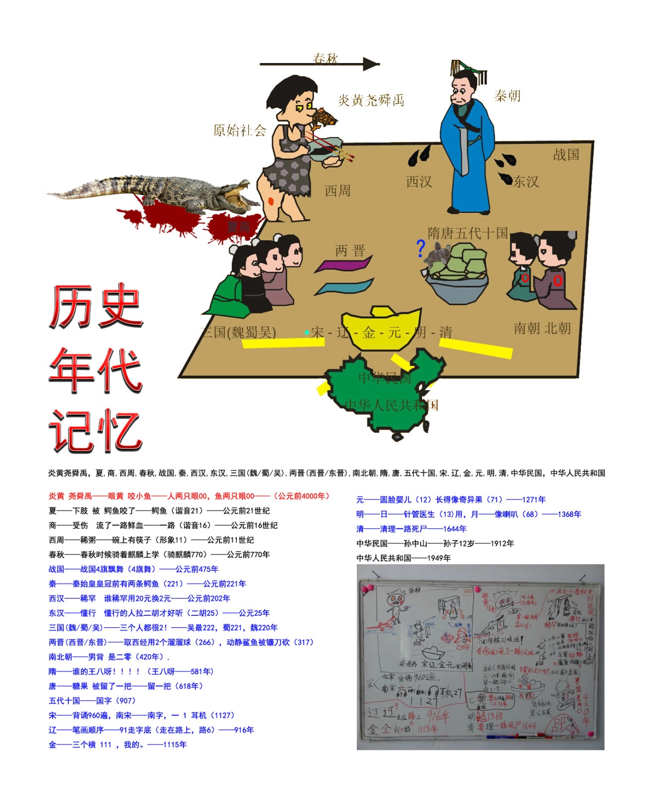

## 春秋

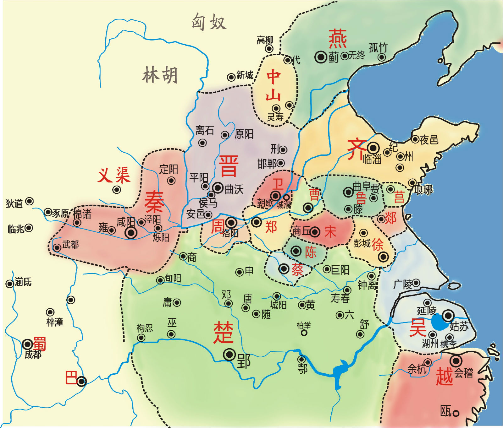

## 南北朝

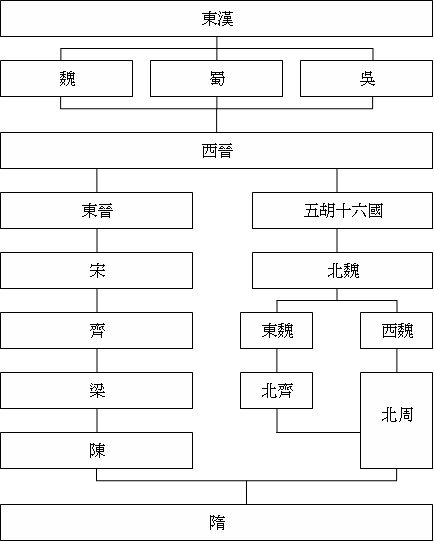

## 欧洲地图

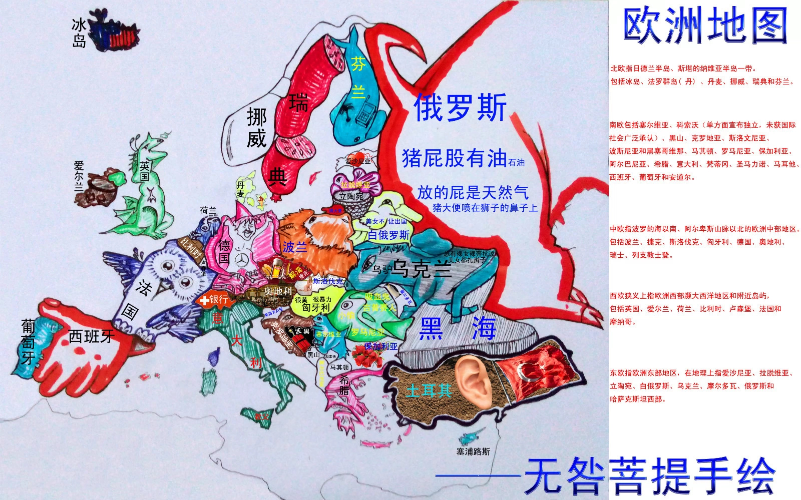

---

$$ 运动 $$

## 颈动脉窦

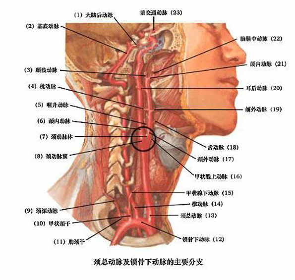

## 肾阳虚

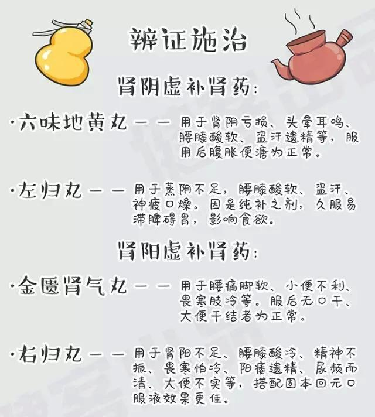

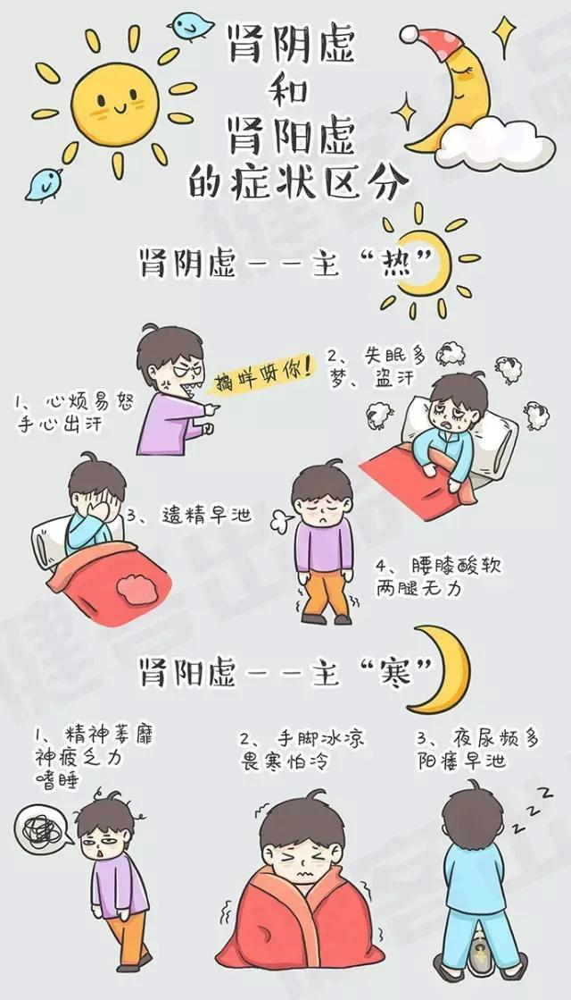

---

$$ 文学 $$

## 唐宋八大家

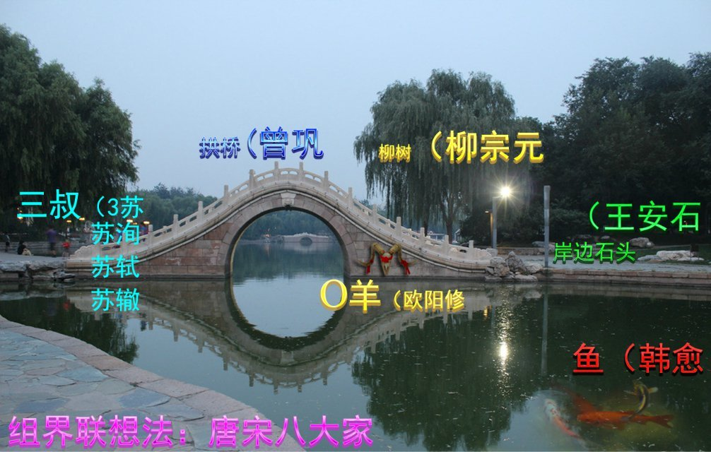

## 三毛-荷西

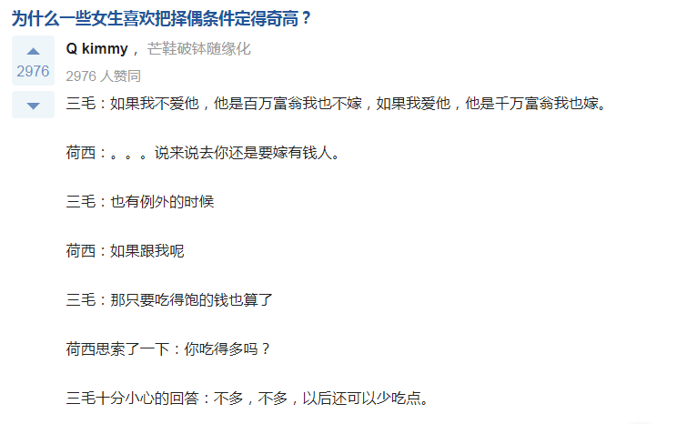

## 慕蔺
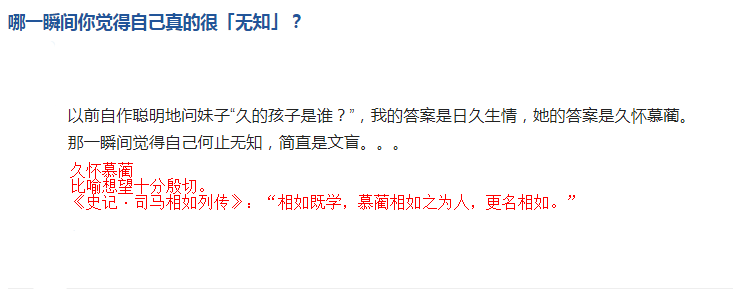

## 好老板
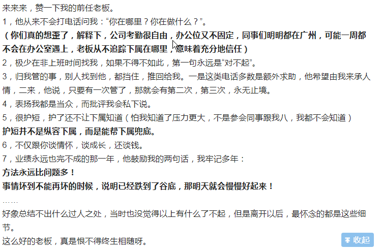

## 媚俗
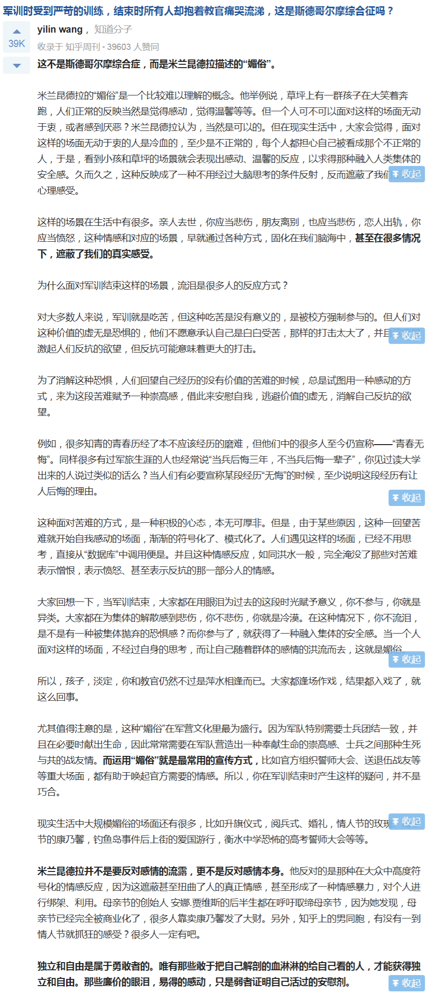

## 简单不等于容易
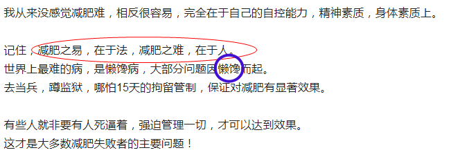

## 刘谦-大师肩膀-罗永浩
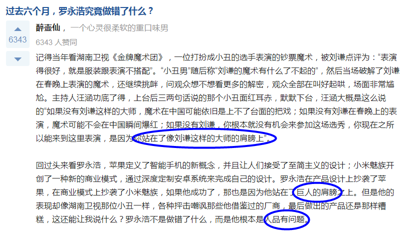

## 图书管理员
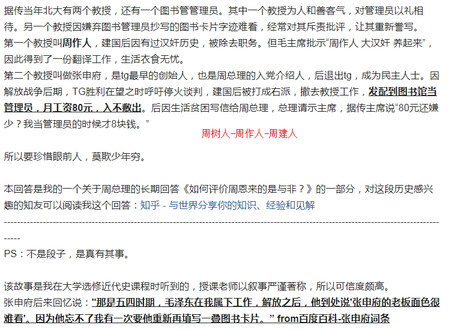

## 话少
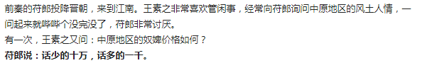

## 情商
- 引出话题
- 不要否定别人

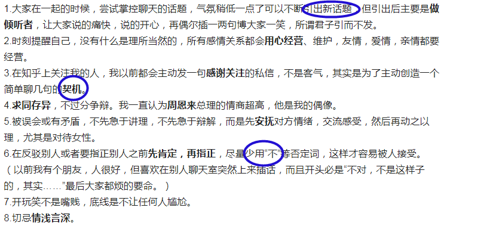

## 所谓的落水鬼，其实就是背锅侠

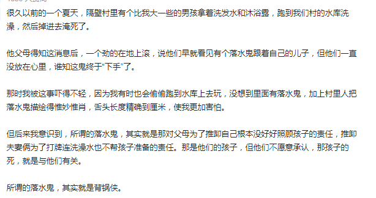

## 取名：文论语，武周易；女诗经，男楚辞

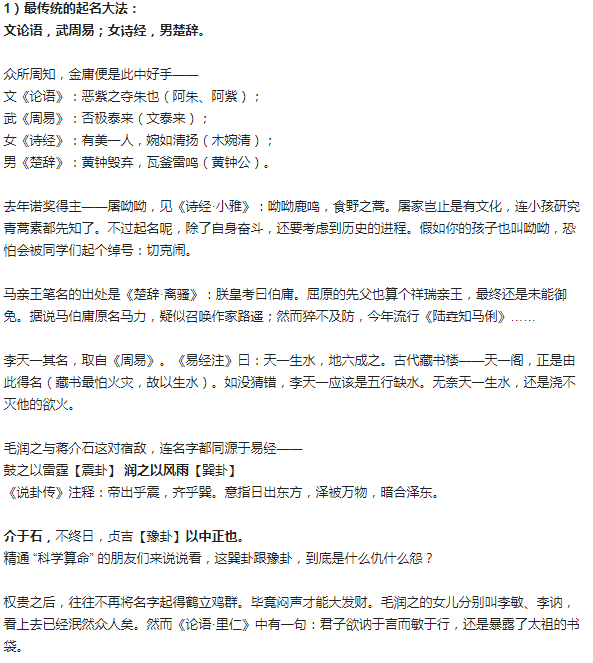

## 既见其生，则不忍见其死
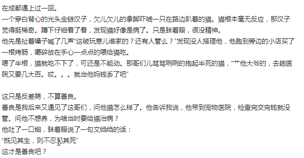

## 朱之文
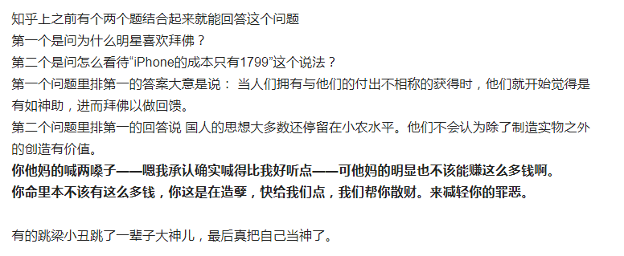

## 痛苦就是痛苦，对痛苦的思考才是财富。失败不是成功之母，总结才是。
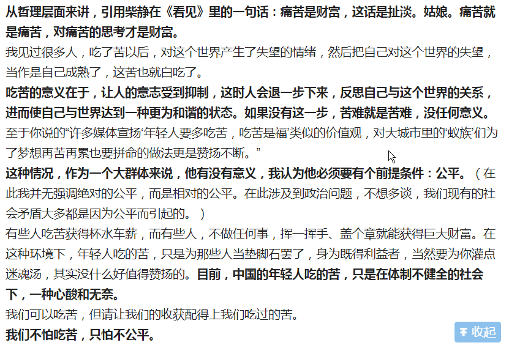
