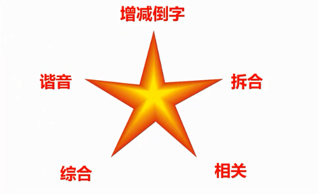

# memory-palace


# A01 中文人名

```
下面是1955年授予的中国人民解放军十大将军，请将你不熟悉的人名，用形象转化的方式记忆下来.。

（1）陈赓

（2）粟裕

（3）罗瑞卿

（4）张云逸

（5）许光达

（6）徐海东

（7）肖劲光

（8）黄克诚

（9）谭政

（10）王树声
```

**鞋子拆观众**



[视频](https://v.qq.com/x/page/y055877ho7i.html)

拆字的时候注意某些字不要太抽象，应该用 **物体**。


呜呜的火车（55年）拉着十大元帅，他们在用`陈`醋洗澡，洗完后把醋达到了一科榆树（`粟裕`）的根（`赓`）上，数死了，啪的一声死亡了(亡树生 - `王树声`)。树倒了，肖峰跑过来把树削清光（`肖劲光`），把他切成一片一片，用罗(`罗瑞卿`)和美女董`卿`两个人挑到市场买，一元一张（`张云逸`），然后赚到了很多钱去赌场，结果输光了（`许光达`），只要又去东海(`徐海东`)，结果路上遇到了林则`徐`，二个人就谈起了政治（`谭政`），准备用`黄`金万两和100`克`拉的砖石去攻城（`诚`）


# A02 外国人名

希腊神话中的十二主神：

宙斯(Zeus)：克洛诺斯和瑞亚之子；掌管天界，是第三任神王；以贪花好色著名。

赫拉(Hera)：宙斯的姐姐和夫人，美丽的天后；婚姻的保护神，尤其是已婚的女人的保护者。

波塞冬(Poseidon)：宙斯的兄弟；掌管大海；脾气暴躁，贪婪。

哈底斯(Hades)：宙斯的兄弟；掌管冥府，同时也是财富之神；有一顶可以隐身的帽子；残忍，可怕，但很守信。

德墨忒耳(Demeter)：克洛诺斯和瑞亚之女，宙斯的姐姐；农业女神。

阿瑞斯(Ares)：宙斯与赫拉之子；战争之神；粗暴而嗜血，但并非真正的勇士。

雅典娜(Athena)：宙斯与美狄丝结合的产物；智慧女神和女战神；她是智慧，理智和纯洁的化身。

阿波罗(Apollo)：宙斯和勒托之子，和阿耳忒弥斯是双生兄妹；太阳神。

阿佛洛狄忒(Aphrodite)：爱，美和欲望之神；从海中的泡沫中生出。

赫尔墨斯(Hermes)：宙斯和迈亚之子；众神中最快者；盗窃者的守护神，商业之神，黄泉的引导者。

阿耳忒弥斯(Artemis)：宙斯和勒托之女，与阿波罗是双生兄妹；美丽的女猎神和月神，青年人的保护神。

赫淮斯托斯(Hephaestus)：宙斯与赫拉之子，神中唯一丑陋者，但老婆却是爱与美之神阿佛洛狄忒；火和锻造之神，为众神制造武器和铠甲；铁匠和织布工的保护神。


这里很多神的名字大家比较熟悉，好多我是通过动画片《圣斗士星矢》认识的，我挑选出6个相对陌生的，请你来记。

1、德墨忒耳

- 德国买的墨水也忒小了，都可以塞进耳朵里面，耳朵都黑了，可以写字了。

- 德国的模特儿耳朵都很大、漂亮

2、阿瑞斯

- 印度阿三带了瑞士手表以为很有钱，却是个司机

- 印度阿三去了瑞士

3、阿佛洛狄忒

- 阿三头定着佛，结果落地了，只能推着走

4、赫尔墨斯

- 陈赫耳朵打了摩丝，尖尖的像阿凡达。

```
hull : 赫尔

n. 船体；（果实的）外壳
vt. [粮食] 去壳
```

5、阿耳忒弥斯

阿凡达的耳朵里面有个特务放了拉了很多米一样的屎

6、赫淮斯托斯

陈赫怀里有只猫，把他的丝袜拉脱丝了。


[视频](https://v.qq.com/x/page/d0559xgcves.html)