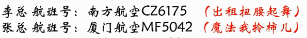

# memory-palace


# A01 中文人名

```
下面是1955年授予的中国人民解放军十大将军，请将你不熟悉的人名，用形象转化的方式记忆下来.。

（1）陈赓

（2）粟裕

（3）罗瑞卿

（4）张云逸

（5）许光达

（6）徐海东

（7）肖劲光

（8）黄克诚

（9）谭政

（10）王树声
```

**鞋子拆观众**


[视频](https://v.qq.com/x/page/y055877ho7i.html)

拆字的时候注意某些字不要太抽象，应该用 **物体**。


呜呜的火车（55年）拉着十大元帅，他们在用`陈`醋洗澡，洗完后把醋达到了一科榆树（`粟裕`）的根（`赓`）上，数死了，啪的一声死亡了(亡树生 - `王树声`)。树倒了，肖峰跑过来把树削清光（`肖劲光`），把他切成一片一片，用罗(`罗瑞卿`)和美女董`卿`两个人挑到市场买，一元一张（`张云逸`），然后赚到了很多钱去赌场，结果输光了（`许光达`），只要又去东海(`徐海东`)，结果路上遇到了林则`徐`，二个人就谈起了政治（`谭政`），准备用`黄`金万两和100`克`拉的砖石去攻城（`诚`）


# A02 外国人名

希腊神话中的十二主神：

宙斯(Zeus)：克洛诺斯和瑞亚之子；掌管天界，是第三任神王；以贪花好色著名。

赫拉(Hera)：宙斯的姐姐和夫人，美丽的天后；婚姻的保护神，尤其是已婚的女人的保护者。

波塞冬(Poseidon)：宙斯的兄弟；掌管大海；脾气暴躁，贪婪。

哈底斯(Hades)：宙斯的兄弟；掌管冥府，同时也是财富之神；有一顶可以隐身的帽子；残忍，可怕，但很守信。

德墨忒耳(Demeter)：克洛诺斯和瑞亚之女，宙斯的姐姐；农业女神。

阿瑞斯(Ares)：宙斯与赫拉之子；战争之神；粗暴而嗜血，但并非真正的勇士。

雅典娜(Athena)：宙斯与美狄丝结合的产物；智慧女神和女战神；她是智慧，理智和纯洁的化身。

阿波罗(Apollo)：宙斯和勒托之子，和阿耳忒弥斯是双生兄妹；太阳神。

阿佛洛狄忒(Aphrodite)：爱，美和欲望之神；从海中的泡沫中生出。

赫尔墨斯(Hermes)：宙斯和迈亚之子；众神中最快者；盗窃者的守护神，商业之神，黄泉的引导者。

阿耳忒弥斯(Artemis)：宙斯和勒托之女，与阿波罗是双生兄妹；美丽的女猎神和月神，青年人的保护神。

赫淮斯托斯(Hephaestus)：宙斯与赫拉之子，神中唯一丑陋者，但老婆却是爱与美之神阿佛洛狄忒；火和锻造之神，为众神制造武器和铠甲；铁匠和织布工的保护神。


这里很多神的名字大家比较熟悉，好多我是通过动画片《圣斗士星矢》认识的，我挑选出6个相对陌生的，请你来记。

1、德墨忒耳

- 德国买的墨水也忒小了，都可以塞进耳朵里面，耳朵都黑了，可以写字了。

- 德国的模特儿耳朵都很大、漂亮

2、阿瑞斯

- 印度阿三带了瑞士手表以为很有钱，却是个司机

- 印度阿三去了瑞士

3、阿佛洛狄忒

- 阿三头定着佛，结果落地了，只能推着走

4、赫尔墨斯

- 陈赫耳朵打了摩丝，尖尖的像阿凡达。

```
hull : 赫尔

n. 船体；（果实的）外壳
vt. [粮食] 去壳
```

5、阿耳忒弥斯

阿凡达的耳朵里面有个特务放了拉了很多米一样的屎

6、赫淮斯托斯

陈赫怀里有只猫，把他的丝袜拉脱丝了。


[视频](https://v.qq.com/x/page/d0559xgcves.html)


不要使用抽象词，画面最好有结果。


# A03 地名记忆

最近看了一本书叫《牧羊少年奇幻之旅》，作者是一位巴西作家，主人公的名字叫圣地亚哥，这勾起了复习一下**南美洲**地理的欲望，下面是一些南美洲重要的一些名字，如果你是中学生，这可是考点哦，如果你已经工作，有机会一定去看看，世界这么大，怎能只记得名字？

请用形象转化的方式记忆下来，并且分享你的想法。


1、拉普拉塔河

- 一个吉普车拉着另外一个吉普车，把搭堆到到河面上过河。
- 拉布拉多狗

2、潘帕斯草原

- 潘玮柏很怕死，一身只敢住在草原，人都绿了
- 潘长江怕死不敢在草原骑马
- 潘：潘长江，潘金莲
- 帕：手帕

3、巴塔哥尼亚高原

- 爸爸在塔山和哥哥把泥做的鸭子扔高原上，鸭子得了高原反应，死了。
- 巴：巴士

4、圭亚那高原

- 乌龟托着一只鸭子来听那英的演唱会，那英声音太高，鸭子都飞走了。
- 亚：哑铃

5、德雷克海峡

- 德国的手雷很差劲，课本都炸不烂。
- 朱德开着雷克萨斯开过了台湾海峡。
- 朱德那了手雷，扔到坦克上炸飞了。

6、合恩角

- 和尚跪舔周恩来的脚。
- 合：百合，合同

[视频](https://v.qq.com/x/page/u0559yknu9a.html)


# A04 化学词语

1、丙二醇

- 盲炳拉着二胡，吃着木糖醇

2、脱氢乙酸钠

- 小青脱掉青色的衣服，喝着酸奶

3、硬脂酸钾

- 

4、黄原胶

5、麦芽糖淀粉酶

6、聚甘油脂肪酸酯

- 甘油酯 - 干柚子
- 酸脂 - 蒜子，孙子

7、乳酸脂肪酸甘油酯

8、代可可脂


[视频](https://v.qq.com/x/page/y0559bcefnt.html)


# A05 电视台抽象图标记忆


# A06 配对记忆中国女性第一人


中国女性十个“第一”

（1）第一位女大使：丁雪松

- 松鼠在大雪天跳着拉丁舞，脚印出一大坨屎

（2）第一位女飞行员：武秀梅

- 武大郎在绣梅花，梅花绣好了就飞了起来
- 武：武大郎，武媚娘

（3）第一位女火车司机：田桂英

- 穆桂英开着火车，出轨了到了田了

（4）第一位女将军：李贞

- 托塔李天王带着病打贞子

（5）第一位女留学生：金雅妹

- 一口金牙的妹子，很有钱，第一个出国留学了

（6）第一位女外交家：冯燎

- 2匹马在撩清，撩着聊着就跑出了国外交流

（7）第一位女中央委员：向警予

- 中央委员，拿着向日葵代枪，警告一条鱼。瓜子射到鱼上。
- 金鱼

（8）第一位女诗人：蔡琰

- 变吃腌菜变做诗

（9）第一位女博士：韦钰

- 韦小宝拿着金玉去泡了一个牛博士，别说嫌弃说没文化

（10）第一位女国际象棋大师：刘适兰

- 刘胡兰用柿子下棋，在国际上引起了关注。

[视频](https://v.qq.com/x/page/q05601r8pni.html)


# A07 第7天：古人的身份证是“字”

我们都知道，曾经学语文时背了不少古人的字和号，要知道，有“字”的古人那都是有身份的人，据《礼记》记载：男子二十冠而字，女子十五笄而字。对于同辈和长辈，我们只能称其“字”，而不能直呼其名。取字的方式，有的是同义的，比如屈原，名平，字原；有的是反义的，比如王绩，字无功；有些是连义推想，比如岳飞，字鹏举。

下面是几位古代名人的字，请用配对联想法记忆你比较陌生的，并把你的想法分享出来。


中国古人的“字”


（1）王阳明，字伯安

- 王阳明，受到佛祖阳光普照，脖子很安全

（2）王昌龄，字少伯

- 边塞诗人，被砍了脖子，少了脖子

（3）司马光，字君实

- 光着屁股拉了个菌出来掉到了屎上面

（4）朱熹，字元晦

- 猪喜欢用元宝绘画

（5）狄仁杰，字怀英

- 狄仁杰那么厉害，是因为胸怀里面有个英雄
- 英：英国，蒲公英

（6）柳宗元，字子厚

- 他很圆，生出来的儿子很厚道
- 厚：衣服很厚
- 柳树中间的圆圆的叶子很厚

（7）范仲淹，字希文

- 范仲淹在岳阳楼记拉稀，写下的文字
- 希：希腊文字

（8）耶律楚材，字晋卿

- (耶律楚材) 阻止成吉思汗家住把中国变成大草原想法的是一个契丹人，因为他和中国人是近亲。
- 耶律：野驴


> 能用本字尽量用本字


[视频](https://v.qq.com/x/page/l0560yb479x.html)


# A08 植物的科属

最近经常在小区和植物园散步，发现很多植物都有“身份证”，挂在脖子上介绍自己的科属，植物分类有不同的层次，包括界、门、纲、目、科、属、种，就好比我们人类身份证上的国家、省份、城市、区、街等，一般我们常说的是植物的科和属，通过它大致可以清楚植物之间的亲戚关系。

下面是几种常见植物的科属，请用配对联想法记忆下来，并把你的想法写出来。

植物的科属：

- 科：科学家
- 属：老鼠

1、蓝莓：杜鹃花科，越橘属

- 杜鹃鸟，俗称布谷，又名子规、杜宇、子鹃。春夏季节，杜鹃彻夜不停啼鸣，啼声清脆而短促，唤起人们多种情思。如果仔细端详，杜鹃口腔上皮和舌部都为红色，古人误以为它啼得满嘴流血，凑巧杜鹃高歌之时，正是杜鹃花盛开之际，人们见杜鹃花那样鲜红，便把这种颜色说成是杜鹃啼的血。
- 把蓝莓手机砸上了杜鹃鸟，砸到了月球，月球边恒了橘子的样子

2、芍药：毛茛科，芍药属

- 一勺药，里面都这很多毛的根。

3、桂花：木犀科，木犀属

- 桂花的根雕成2只（科和属一样）木的犀牛。很贵哦

4、栀子花：茜草科、栀子属

- 栀子花很白，小茜把她和草放一起送给我。一清二白

5、樱花：蔷薇科、樱属

- 蔷：墙
- 薇：紫薇

6、海棠：蔷薇科、苹果属

- 

[视频](https://v.qq.com/x/page/e0560o94ka8.html)


# A09 老总们的航班号


小韩的公司最近举办招商会，有很多老总从全国各地来，小韩作为司机要去接机，他只看了一遍就记住了所有老总的航班号，并且在查询台查到降落时间，小韩的老板问起他来，他都可以脱口而出，小韩因为记忆力好，成为老板身边的红人。

下面是5位老总的航班信息，请用配对联想法记忆下来，并把你的想法写出来。


李总 航班号：南方航空CZ6175

- 

张总 航班号：厦门航空MF5042  

-

赵总 航班号：西部航空PN6220   

-

袁总 航班号：华夏航空G5 2910  

-

巴总 航班号：山东航空SC2214

- 



[视频](https://v.qq.com/x/page/s056064pemh.html)

# A10 的士司机的车牌号

最强大脑李威曾经在中广核记住1000辆车的车牌号，国际记忆大师吕柯姣在杨陵记忆大师训练基地，可以说出很多车的车牌号和它经常停的地方。有时候我们在遇到交通肇事逃逸，或者是出现东西落在了的士上的情况，如果能够有意识地提前记住车牌号，可以让我们省下不少事情。

下面是5位的士司机的车牌号，你在上车后就迅速记忆下来，请用`配对联想法`记忆，并把你的想法写出来。


```
的士师傅的车牌号

1、李师傅：陕VY3092 

2、柳士攀：鄂BZV289

3、王师傅：津A21787

4、张无令：沪EB38C3

5、柳师傅：晋A38C32
```

[视频](https://v.qq.com/x/page/b0560cyai7a.html)


# A11 奥斯卡最佳影片

奥斯卡金像奖，也称奥斯卡奖，原名学院奖，正式名称是“电影艺术与科学学院奖”，设立于1927年，每年一次在美国洛杉矶举行。该奖是由美国电影艺术与科学学院颁发，旨在鼓励优秀电影的创作与发展的奖项，半个多世纪来一直享有盛誉。每年的最佳影片都是备被关注，特别是去年的乌龙事件。 


下面是近10年的奥斯卡最佳影片，请用`数字定桩法`对应记住第多少届的获奖影片是什么，并把你的想法写出来。


```

第80届奥斯卡（2007-2008年度）
最佳影片：《老无所依》 


第81届奥斯卡（2008-2009年度）
最佳影片： 《贫民窟的百万富翁》


第82届奥斯卡（2009-2010年）
最佳影片：《拆弹部队》


第83届奥斯卡（2010-2011年）
最佳影片：《国王的演讲》


第84届奥斯卡（2011-2012年）
最佳影片：《艺术家》


第85届奥斯卡（2012-2013年）
最佳影片：《逃离德黑兰》


第86届奥斯卡（2013-2014年）
最佳影片：《为奴十二年》 


第87届奥斯卡（2014-2015年）
最佳影片：《鸟人》


第88届奥斯卡（2015-2016年）
最佳影片 ：《聚焦》 


第89届奥斯卡（2016-2017年）
最佳影片 ：《月光男孩》

```

[视频](https://v.qq.com/x/page/k0558o4sytt.html)


# A12  中国十大名关 (熟语桩)

“关”是指古代的关卡，一般是兵家必争之地，地理位置非常重要，如今有些成为旅游景点。下面是中国十大名关，请用`《乐府诗集·木兰诗》`里的句子：“`万里赴戎机，关山度若飞。`”作为`熟语桩`，分别和每一个关名进行联想，并且将想法写下来。

```
中国十大名关

（1) 山海关：山海关位于河北省秦皇岛东北15公里处，因位于山海之间而得名。这是东北与华北相接的咽喉要冲，是万里长城起点的第一道雄关，号称“天下第一关”。

（2) 武胜关：武胜关位于河南省与湖北省交界的大别山脉的鸡公山下，它与平靖关，妨里关合称“义阳三关”，是历代兵家必争之地。有“关中之关”的美誉。

（3) 友谊关：友谊关位于广西凭样市西南18公里处，原名镇南关，附近是崇山峻岭，关藏山谷深处，为西南边防的重镇。

（4) 嘉峪关：嘉峪关是举世闻名的万里长城西端的重要关隘，它位于甘肃嘉峪关市，古称“天下雄关”。

（5) 雁门关：雁门关位于山西省代县县城西北的雁门山腰，历朝历代都是拱卫京都，屏保中原的兵家重地。

（6) 紫荆关：紫荆关位于河北省紫荆岭上，是内长城的重要隘口之一，因位于居庸关和倒马关之间，明代时合称它们“内三关”，是由河北平原进入太行山区的要口。

（7) 娘子关：娘子关位于山西平定县和河北省的交界处，是出入山西省的咽喉之地。唐朝初年，高祖李渊的三女儿平阳公主曾率兵镇守此地，因而得名“娘子关”。

（8) 居庸关：居庸关始建秦代，位于北京市昌平区，是长城险要关口之一，这里有昔日著名的燕京八景之一的“居庸叠翠”。

（9) 剑门关：剑门关位于四川省剑阁县的剑门山上，形同利剑，高连霄汉、峭壁中断处，两山对峙，有如两扇门。

（10) 鬼门关：鬼门关位于广西北流县城西，地处于六万大山与大容山交界之处，因为此地过去多瘴疠，去得者难得生还，故名为“鬼门关”。但如今金色秀丽。

```

[视频](https://v.qq.com/x/page/r0560erkxsm.html)


