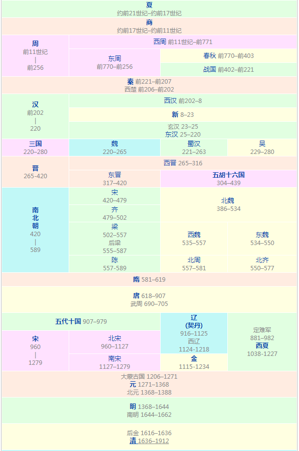

# 史前时期

### 旧石器时代

约73万年前：北京直立人，已经会使用火，并会保存火种，有部分学者认为北京直立人与中国现代人类并无连续演化关系。

公元2万~1万年前：山顶洞人

约5万年~5千多年前：长滨文化

## 新石器时代

前7500年前：彭头山文化，最早出现稻谷的中国史前文化。

前7000年前：裴李岗文化

前6000年前：磁山文化

前3000年前：龙山文化（黑陶文化）

7,000年前-5000年前：大坌坑文化

约在公元前3300年至公元前2500年：圆山文化

## 青铜时代

约1800至500年前:十三行文化:十三行文化的主要特征是石器减少，只剩下凹石、石槌等无刃器。证明了十三行的史前居民不仅会使用铁器，更已经会制造铁器，拥有炼铁的技术。除了石、铁外，还有为数不少的陶器，主要是红褐色夹砂陶，特征是手工制作，含细沙，火候高、质地坚硬。

2000年前到400年前:番仔园文化

---

# 夏商周

## 夏朝

约前2029年：禹建立夏朝。

- 甲鱼带着2只耳环，每一只上面吊着一只狗。

约前1950年：夏王少康消灭有穷国，中兴夏朝。

- 少康为了抢穷人的中兴手机，用衣钩杀死了有穷国的武林高手。

约前1559年：商汤于鸣条之战打败夏桀，夏朝灭亡。

- 鹦鹉受伤了，喝了汤之后功力大增，杀死了夏桀武警，夏朝灭亡。

## 商朝

约前1320年：商王于盘庚时把都城自奄迁殷，甲骨文和金文得到发展。

- 盘庚迁殷，医生手上拿着一盘树根，踩着2个耳环做的风火轮

前1264年：商王武丁分封他的叔父蔓叔于邓国。

- 

前1147年：商王武乙继位，与巫术作斗争，实行礼制改良。

- 

前1046年：周武王于牧野之战击败商王帝辛的军队，商朝灭亡。

- 周武王在都是木头的野外，用高尔夫球打死了帝辛骑着的牛（死牛=46）

## 西周

前899年：周懿王元年，郑国的天亮了两次(发生了日食)。

- 天上有2个月亮的时候，郑少秋拿着葫芦，把舅舅收了。

前842年：都城发生平民暴动，周厉王逃离至彘。

- 84冲进入了城了，一群鹅吓得发出啦了，人民纷纷吓跑了。周厉王逃离至猪栏。
- 彘，本指大猪，后泛指一般的猪

前841年：召穆公、周定公共同行政（一说由诸侯共伯和摄政），号称共和

- 第二年

前771年：西夷犬戎攻入西周都城镐京，杀周幽王，周平王继位。

- 犬戎用机器人（77）拿着镐（haojing）把周幽王的衣（1）服扒了杀死。
- 烽火戏诸侯

前770年：周平王向东迁都至雒邑。

- 第二年，瓶子（周平王）上插着牡丹花（洛阳）
- 【雒邑】luò yì雒邑，即洛邑，后即为洛阳。
  
## 春秋

前722年：郑庄公平定共叔段之乱。时为鲁隐公元年，史书《春秋》编年始于此。

- 

前720年：周平王、郑庄公互派儿子为人质，周天子地位大为降低。

前707年：周桓王率诸侯军队伐郑，被郑庄公打败且肩膀中箭，诸侯争霸时代开始。

前704年：楚武王熊通称王，为诸侯称王之始。

前685年：齐桓公立，以管仲为相，实施变法。

前656年：齐桓公率诸侯联军迫楚国签订召陵之盟，成为春秋五霸之首。

前632年：晋文公率兵救宋，在城濮之战大败楚军，后会盟于践土，成为中原霸主。

前627年：秦、晋会战于殽，秦全军覆没，其后转向西发展，称霸西戎。

前597年：楚、晋会战于邲，楚大胜。

前579年：宋大夫华元调和晋、楚，为第一次弭兵会盟。

前575年：楚、晋会战于鄢陵，晋大胜，楚共王伤目。

前546年：宋大夫向戌邀晋楚和各诸侯国举行第二次弭兵会盟，晋楚之间维持数十年和平。

前506年：吴王阖闾以伍子胥为将，统兵伐楚，攻进楚都郢。

前496年：吴军伐越，阖闾战败并因伤而亡。

前494年：吴王夫差兴兵败越，越王勾践求和。

前473年：越王勾践消灭吴国，夫差自杀。勾践与齐晋会盟于徐，为春秋最后一个霸主。

## 战国

前453年：晋国氏族韩、赵、魏三家尽灭智氏，瓜分其地。

前434年：晋哀公死，晋幽公即位。韩、赵、魏瓜分晋国剩余土地，只留绛与曲沃两地。

前409年：魏伐秦，筑临晋、元里。

前408年：魏击宋，守中山。伐秦至郑，还筑洛阴、合阳。

前403年：三家分晋。司马光《资治通鉴》所载始于此年。

前386年：周安王正式册命田和为齐侯，取代姜氏齐国。

前379年：齐康公死，姜太公一系绝祀，田氏并其食邑。

前359年：秦孝公任用商鞅，实施变法。

前354年：魏围攻赵都邯郸。

前353年：赵求救于齐，齐孙膑引兵攻魏都大梁（今河南开封），又在桂陵大败魏军。

前344年：魏侯召集逢泽之会，率诸侯朝见周天子，为中原诸侯首先称王者。

前343年：魏发兵攻韩，韩求救于齐。

前342年：齐在马陵之战大败魏军，魏将庞涓兵败自杀。

前340年：秦拜卫鞅为商君

前314年：燕国内乱，齐国占领燕国，后退兵。

前307年：赵武灵王实行胡服骑射。

前287年：赵、魏、韩、燕、楚五国联兵攻秦，秦被迫割地给赵、魏以求和。

前286年：齐国攻灭宋国。

前284年：燕、秦、韩、赵、魏五国联兵攻齐，燕军陷齐都临淄。齐失七十余城，只余莒和即墨。

前278年：即墨守将田单火牛阵大败燕军，齐国复国，但国力已衰。

前280年：楚国逆长江上游攻秦，战败而遭秦反攻。

前279年：楚国于鄢之战败于秦军。

前278年：楚都郢被秦将白起攻陷，迁都到陈；楚国诗人屈原投汨罗江自尽。

前271年：范雎向秦昭王献“远交近攻”之策。

前262年：秦伐韩，切断上党郡与韩都新郑的联系。上党求救于赵，赵派老将廉颇率军声援。

前260年：秦将白起在长平之战大败赵军，坑杀40万降卒。

前258年：魏信陵君、赵平原君、楚春申君大破秦军于邯郸城下；后信陵君率军于函谷关再胜秦军。

前256年：周赧王病逝，秦国攻入雒邑，西周公投降，周朝灭亡。

前249年：秦相吕不韦带兵灭位于巩邑的东周公。

前241年：楚再迁都至寿春以避秦军，再也无能力抗秦。

前230年：秦灭韩。

前228年：秦灭赵。

前225年：秦灭魏。

前223年：秦灭楚。

前222年：秦灭燕、越。

前221年：秦灭齐，统一中原。

---

# 秦汉三国

## 秦朝

前219年：秦始皇举行封禅大典。

前214年：秦始皇命蒙恬率三十万大军北伐匈奴，占领河套地区。

- 情人节，蒙着脸的景甜带了30万美女北山隆胸

前213年：秦始皇焚毁五经、活埋儒士。

- 第二年

前210年：秦始皇亡于东巡，宦官赵高与丞相李斯拥立次子胡亥，假诏赐死长子扶苏。

- 鳄鱼咬了秦始皇的蛋，死了。

前209年：陈胜、吴广运送士兵逾期，为避免遭处斩，于大泽乡“揭竿起义”。

- 第二年就起义了

前208年：赵高陷害李斯，腰斩于咸阳，夷三族。

- 

前207年：项羽率楚军于大破秦军。同年刘邦率军入秦都咸阳，秦亡。
楚汉相争（西楚）

- 

前206年：项羽尊楚怀王熊心为楚义帝。12月，项羽自封为西楚霸王，分封十八路诸侯。刘邦被封为汉王。

前206年：韩信领军暗渡陈仓大败章邯

前205年：项羽率西楚军于彭城击溃汉军。

前203年：汉立韩信为齐王。

前202年：汉军包围楚军于垓下，项羽突围后于乌江自刎而死。

## 西汉

前200年:刘邦率汉军北伐匈奴，被围困于白登，贿赂匈奴阏氏才得以脱险。韩信改封楚王。

前196年: 阳夏侯陈豨及淮南王英布起兵反叛被平定。韩信及梁王彭越被杀，击起消灭异姓王风潮。

前154年：【七国之乱】--吴王刘濞联合胶西王、楚王、赵王、济南王、菑川王及胶东王起兵叛变，为太尉周亚夫率军平定。

前140年：汉武帝始用年号【建元】。

前140年：汉武帝采儒生董仲舒之议，罢黜百家，表章六经。

前139年：张骞出使西域。

前127年：卫青北击匈奴，收复河南地、陇西、北地、上郡的北部，置朔方、五原二郡。

前126年：张骞返国。

前121年：霍去病出陇西击灭居于河西走廊的匈奴部落，以其地设酒泉郡。后又分割为张掖、敦煌、武威三郡。

前60年：汉宣帝正式设立西域都护府。

前9年：王莽继任大司马大将军。

5年：王莽立两岁的孺子婴为皇太子，自称“摄皇帝”或“假皇帝”。

8年：王莽篡位孺子婴禅让后自立为帝，改国号为新。

## 新朝

17年：绿林军兴起于荆北。
18年：赤眉军兴起于青徐地区。
23年：昆阳之战王莽被杀，新朝灭亡。刘玄为更始帝国号仍为汉，史称玄汉。
25年：刘玄投降赤眉军后被杀。刘秀为汉光武帝，国号仍为汉，史称东汉或后汉。

## 东汉

35年：马援击破先零羌于临洮（今甘肃岷县）。
37年：东汉统一战争结束。
43年：马援平定交阯反叛。(今越南中部)
74年：班超出使疏勒。耿秉、窦固率1.4万骑进军西域。
89年：南匈奴与汉联合夹击北匈奴，先后败之于漠北和阿尔泰山，迫使其西迁，从此几十年后北匈奴从中国古书中消失。
92年：汉和帝与宦官郑众密谋，铲除外戚窦宪。汉和帝亲政。
97年：班超派甘英出使大秦，至安息西界而还。
166年：第一次党锢之祸。
168年：第二次党锢之祸。
184年：张角兴兵于钜鹿、广宗反汉，爆发黄巾之乱。
189年：汉灵帝崩后，何进引董卓入京，董卓废帝，各地军阀举兵反董卓。
190年：董卓挟帝迁都长安，群雄割据的局面开始。
191年：刘表击败孙坚。袁绍击败韩馥。
192年：吕布杀董卓。董卓余部李傕、郭汜等占领长安。
196年：曹操挟汉献帝到许昌。
197年：袁术称帝。张绣诈降击败曹操。
198年：曹操消灭了吕布的势力。
199年：袁绍消灭了公孙瓒的势力。
200年：曹操于官渡之战击败袁绍军。
207年：曹操统一北方。
208年：孙权、刘备联军于赤壁之战大败曹军。
211年：曹操讨伐汉中张鲁。韩遂，马超反曹。
214年：刘璋投降，刘备入主益州。
220年：汉献帝被迫禅位，曹丕篡汉自立，改国号“魏”，史称“曹魏”，东汉亡。

## 三国

221年：刘备于成都称帝，国号仍为“汉”，史称“蜀汉”。
222年：刘备战败于夷陵之战，孙权取得大部分荆州。
223年：刘备病殁，诸葛亮辅佐其子刘禅，并与孙权恢复同盟。
225年：蜀汉诸葛亮平定南中叛军，雍闿等被杀，孟获投降。
227年：诸葛亮第一次北伐。
229年：孙权于建业称帝，国号吴。
234年：诸葛亮最后一次北伐，同年病死于五丈原。
240年：蜀汉大将姜维第一次北伐。
249年：曹魏大臣司马懿发动政变，史称高平陵之变，诛宗室曹爽。
262年：姜维最后一次北伐。
263年：曹魏灭蜀汉。
264年：灭蜀元勋锺会及姜维叛变，被司马昭平定，钟会及姜维被杀。
266年：司马炎篡魏自立，国号晋，曹魏灭亡。
280年：晋灭吴，统一中国。三国时期结束。

---

# 晋十六国

## 西晋

279年，司马炎下令六路晋军攻吴。
280年，吴主孙皓出降，吴亡。
291年，惠帝皇后贾南风唆使楚王司马玮杀汝南王司马亮，开启八王之乱。
296年，氐族人杨茂搜率部落迁至仇池，称王，史称“前仇池”。
300年，凉州刺史张轨及其子张寔守土保境，中原百姓纷纷前来避乱。张氏虽然接受东晋封号，但与东晋相距万里，实际上也是一个割据政权。
304年，匈奴贵族刘渊起兵，称汉王。同年氐族李雄在益州称成都王。
306年，李雄称帝，国号“成”。同年晋东海王司马越消灭其他对手，控制朝政，毒死惠帝，立怀帝，八王之乱结束
307年，慕容廆称前燕单于，开始割据，以龙城（今辽宁朝阳）为国都，招徕中原地区的汉族流民，组织屯田垦荒。
308年，刘渊称帝，建都平阳，国号“汉”。
310年，刘渊死，刘聪即位。
311年，汉帝刘聪攻陷洛阳，掳晋怀帝司马炽，放火焚宫，屠杀官民，史称“永嘉之祸”。
313年，祖逖受命为豫州刺史，率部属北渡长江。
316年，晋愍帝投降被杀，西晋灭亡。

## 东晋／十六国

317年，琅邪王司马睿在建康称晋王。
318年，司马睿即帝位，为晋元帝。
319年，汉帝刘曜改国号为“赵”，史称“前赵”。同年石勒称赵王，史称“后赵”。
320年，凉州牧张茂建年号永元，已成为实质独立政权。
321年，晋元帝派戴渊为征西将军，以监督祖逖。同年祖逖激愤患病而亡。
322年，王敦起兵攻陷建康，史称“王敦之乱”。同年石勒南进，再占黄河以南之地。
329年，后赵灭前赵。
337年，慕容皝称燕王，史称“前燕”。
338年，成帝李寿改国号为“汉”，史称“成汉”。同年代王拓跋什翼犍自立，国号“代”。
342年，前燕击败了后赵的二十万大军，建都龙城。
345年，凉州张骏称凉王，都姑臧，国号“凉”，史称“前凉”。
346年，东晋桓温讨伐成汉。
347年，东晋桓温灭成汉。
350年，氐族人苻洪占据关中，称三秦王，不久为后赵毒杀。同年冉闵夺后赵政权称帝，国号“魏”，建都邺，史称“冉魏”。
351年，苻健称帝，定都长安，国号“大秦”，史称“前秦”。
352年，前燕杀冉闵，攻破邺都，冉魏亡。
354年，东晋桓温北伐前秦，苻健采用坚壁清野战术，打败晋军，桓温缺粮撤退。
356年，东晋桓温击溃河南姚襄，收复洛阳，修谒皇陵。
369年，东晋桓温讨伐前燕，初胜，后为燕将慕容垂败于枋头。
370年，前秦擒慕容𬀩，灭前燕。
371年，前秦灭前仇池。
373年，前秦攻取东晋梁、益二州，西南夷邛、筰、夜郎皆归附于秦。
376年，前秦灭前凉；同年，乘鲜卑拓跋氏衰乱之际，进兵灭代，统一北方。
383年，前秦将领吕光讨平西域。同年前秦出兵伐晋，大败于淝水，史称“淝水之战”。
384年，前秦原前燕降将慕容垂自称“燕王”，废除前秦年号，建立后燕。北地长史慕容泓自称济北王，建立西燕；苻坚派子苻叡及羌人将领姚苌出兵讨伐西燕，大败。姚苌逃到渭北，建立后秦。
386年，拓跋珪即代王位，重建代国；不久改国号为“魏”，史称“北魏”。同年吕光称大将军、凉州牧。后燕、后秦、西燕皆先后称帝。
389年，吕光称三河王，后改称天王，史称“后凉”。
394年，后燕灭西燕。
395年，后燕伐北魏，大败于参合陂。
399年，拓跋珪称帝，为魏道武帝。同年后秦乘东晋内乱，陷洛阳，淮汉以北诸城多请降。
403年，东晋桓玄篡位称帝，建国桓楚。
404年，刘裕举兵讨伐桓玄，桓玄败走蜀地，途中被杀。
405年，刘裕肃清桓氏势力，迎晋安帝复位，掌控朝廷。
407年，汉人冯跋灭后燕，拥立高云为天王，建都龙城，国号仍用“燕”，史称“北燕”。同年匈奴人赫连勃勃自称大夏天王、大单于，建立大夏政权。
409年，高云被部下所杀，冯跋平定政变后即天王位于昌黎。
417年，东晋破长安，姚泓降，后秦亡。
417年，大夏取长安，称帝。
420年，刘裕废晋恭帝自立，建国号“宋”，史称“刘宋”或“水宋”。东晋亡，进入“南北朝时期”。

---

# 南北朝

431年，夏主赫连定灭西秦；欲渡黄河击北凉遭吐谷浑袭击，兵败被俘，夏亡。
436年，北魏灭北燕。
439年，北魏灭北凉，统一北方。
477年，宋将军萧道成弑帝刘昱，拥立宋顺帝，独揽朝政。
479年，萧道成篡位，建国号“齐”，史称齐高帝，南宋亡。
485年，北魏孝文帝依汉人李安世之议，颁布均田令。
502年，齐宗室萧衍篡位，建国号“梁”，史称梁武帝，南齐亡。
510年，梁实施大明历。
534年，北魏孝武帝元修与权臣高欢关系决裂，逃到关中投奔宇文泰。高欢在邺城拥元善见为帝，是为东魏。其后宇文泰杀元修，在长安立元宝炬为帝，是为西魏。
548年，东魏降将侯景勾结梁京城守将萧正德，举兵谋反，史称“侯景之乱”。
550年，高欢的儿子高洋建立北齐，东魏亡。
551年，侯景自立为汉帝。
552年，陈霸先、王僧辩先后击败侯景，侯景为部下所杀。
553年，梁湘东王萧绎继位于江陵，为梁元帝。
554年，萧詧引西魏军攻陷江陵，杀害梁元帝。
555年，萧詧称帝，并对西魏称臣，史称“后梁”。
557年，梁权臣陈霸先篡位，建国“陈”，史称•陈武帝，南梁亡。同年宇文泰的儿子宇文觉建立北周，西魏亡。
577年，北周军攻占邺城，高纬逃亡被擒，北齐亡。
580年，北周外戚杨坚自称大丞相。
581年，杨坚受禅代周称帝，改国号“隋”，史称隋文帝，北周亡。
584年，隋文帝命宇文恺兴建广通渠。
587年，隋灭后梁。
588年，隋起兵伐陈。
589年，隋军攻入建康，陈叔宝被俘，南陈亡。

---

# 隋唐

## 隋朝

581年，突厥沙钵略可汗举兵入侵隋朝。
583年，隋军分八路北伐突厥。
598年，高句丽袭击辽西，隋文帝派汉王杨谅迎战，败于高句丽。
599年，东突厥突利可汗战败降隋。
602年，隋征服越南前李朝，北越南地区纳入版图。
604年，隋炀帝派杨素、宇文恺于洛阳兴建东都。
605年，迁都洛阳。同年隋炀帝开凿通济渠。同年隋将韦云起率突厥兵大败契丹。
611年，西突厥处罗可汗降隋。
612年，隋炀帝发兵讨伐高句丽，大败。
613年，隋炀帝再次发兵征讨高句丽，因杨素子杨玄感谋反，退兵回国镇压。
614年，隋炀帝三度发兵征讨高句丽，婴阳王遣返杨玄感同党斛斯政，隋因而撤军。
618年，宇文化及等人发动兵变，弑炀帝。同年李渊受隋恭帝杨侑禅让，建立唐朝。
619年，王世充废他所拥立的另一位隋恭帝杨侗，隋亡。同年王世充自立为帝，建国号“郑”。
唐朝
620年，李世民击败入侵河东的刘武周、宋金刚。同年洛阳郑帝王世充与河北夏帝窦建德结盟抗唐。
622年，李世民击溃郑、夏联军，俘窦建德，王世充投降。
626年，李世民发动玄武门之变。李渊让位，成为太上皇。李世民继位，即唐太宗。
629年，唐将李靖率骑兵攻灭东突厥。
630年，北方各族入贡长安，诸民族尊称唐太宗为“天可汗”。
635年，唐将李靖攻占吐谷浑。
641年，唐派文成公主与吐蕃赞普松赞干布通婚。
648年，在东胡鲜卑后裔青牛白马之后住地设置松漠都督府，酋长任都督并赐李姓。
655年，武昭仪被立为皇后。
657年，唐将苏定方西征攻下西突厥汗国。
664年，武后杀宰相上官仪，权力日盛，与高宗并称“二圣”。
666年，唐高宗封禅。
668年，唐灭高句丽。
670年，唐与新罗之间的战争爆发。
672年，吐谷浑故地为吐蕃所占。
677年，高句丽旧地为新罗所占。
690年，武则天废睿宗，即帝位，改国号“周”，定都洛阳，史称“武周”。同年，武则天创殿试。
705年，唐中宗复辟。
710年，金城公主嫁入吐蕃。同年，韦后与安乐公主谋杀中宗，立李重茂为帝，韦后摄政。同年，李隆基率禁军杀韦后等，拥其父睿宗为帝。
712年，唐睿宗传位于李隆基，是为唐玄宗。
713年，玄宗改元开元。
742年，安禄山为平卢节度使。同年，李白入长安。
745年，册封杨贵妃。
751年，唐将高仙芝于怛罗斯战役败于阿拔斯王朝与石国联军。
752年，杨国忠为相。
755年，安史之乱爆发。
756年，安史叛军入长安，唐玄宗出奔蜀地。至马嵬驿，军士哗变，杨国忠、杨贵妃被杀。
762年，史朝义自缢，安史之乱平定。
783年，泾原兵变，唐德宗出奔。
787年，贞元劫盟。
791年，吐蕃陷安西都护府，西域自此断绝。
806年，唐宪宗即位，是为元和中兴。
819年，全国节度使服从。藩镇割据局面暂告结束。
821年，牛李党争始。
841年，唐武宗即位，是为会昌中兴。
845年，唐武宗大规模取缔佛教。
846年，唐宣宗即位，是为大中之治。同年李德裕被贬，自此党争渐平。
851年，张议潮起义反吐蕃，复十一州归唐。被任命为归义军节度使。
874年，王仙芝在长垣起兵。
875年，黄巢在冤句起兵，响应王仙芝。
884年，黄巢连败于李克用、朱温，后为部下所杀。
893年，钱镠任镇海节度使。
902年，大迭烈府夷离堇（军事首领）领兵40万伐河东代北，下九郡。
903年，南取河东怀远军，略地蓟北（河北北部）。升于越，总知军国事，成为部落联盟的实际操纵者。
904年，朱全忠杀宰相崔胤，逼迫唐昭宗迁都洛阳。
905年，唐朝垂亡，他应晋王李克用之邀到云州（山西大同）相会，结为兄弟，约定共讨梁王朱温和卢龙节度使刘仁恭，但终因无利可图而没有践约。
906年，十二月，遥辇氏部落联盟首领痕德堇可汗去世，遗命推选阿保机为汗。
907年，朱温逼迫唐哀宗禅让，建国号“梁”，史称“后梁”。唐亡，进入五代十国时期。高季兴任荆南节度使。后梁封钱镠为吴越王。

---

# 五代十国／契丹（辽）

916年，耶律阿保机登基称“大圣大明天皇帝”，定国号为“契丹”。
917年，南海王刘䶮在番禺称帝，国号“大越”。
918年，大越改国号为“汉”，史称“南汉”。契丹定都临潢府（巴林左旗）。
920年：创契丹大字。
923年，李存勗在太原称帝，建国号“唐”，史称“后唐”庄宗。同年唐军攻入汴州，后梁亡。
924年，高季兴受封为南平王，成立割据政权，以荆州为首府，史称“南平”或“荆南”。
925年，后唐庄宗派郭崇韬、李继岌率军攻入成都，王衍投降，前蜀亡。
925年，东征
930年，东丹王耶律倍南逃后唐。
932年，西川节度使孟知祥杀东川节度使董璋，取得东川，被后唐明宗封为蜀王。
934年，孟知祥在成都称帝，国号“蜀”，史称“后蜀”。
936年，契丹与石敬瑭联军攻入洛阳，后唐灭亡。石敬瑭称帝，国号“晋”，史称“后晋”，移都开封。
938年，石敬瑭割让燕云十六州予契丹。
946年，契丹派张彦泽率兵入开封，石重贵投降，后晋亡。契丹改国号为“大辽”。
947年，河东节度使刘知远于太原称帝，国号“汉”，史称“后汉”。
950年，郭威诛隐帝，建都汴，改国号“周”，史称“后周”。后汉亡。
951年，南唐将领边镐率军攻楚，占领长沙，楚灭亡。马殷旧将刘言起兵击败南唐军，继续据有楚地。
952年，王进逵杀刘言，控制楚地。
955年，部将潘叔嗣杀王进逵。潭州军府事周行逢进军朗州杀潘叔嗣，被后周任命为武平节度使，控制楚地。后周攻占后蜀之秦、阶、成、凤四州。
960年，殿前都点检赵匡胤谎报兵情，借口领兵到陈桥驿发动兵变，夺取后周帝位，建国号“宋”。

---

# 宋辽金夏

## 北宋／辽／西夏

962年，周行逢死，子周保权继位，部将张文表起兵反叛，兵败被杀。宋发兵攻占潭州。
963年，宋军攻占江陵，高继冲投降，荆南亡。宋军平定武平。
964年，宋太祖发兵攻后蜀。
965年，孟昶投降，后蜀亡。
970年，宋发兵讨伐南汉。
971年，刘𬬮投降，南汉亡。
974年，宋发兵讨伐南唐。
975年，宋军攻陷金陵，李煜奉表投降，南唐亡。
978年，钱俶降宋，吴越亡。
979年，宋灭北汉。宋太宗起兵伐辽，败于高梁河之战。
980年，辽景宗耶律贤发兵伐宋，辽军攻占瓦桥关后退去。
983年，大辽改国号回“契丹”。
986年，宋发兵伐辽，败于岐沟关。
1004年，宋、辽订立澶渊之盟。
1038年，李元昊称帝，即夏景宗，定都兴州并改称为兴庆府，国号“大夏”，史称“西夏”。
1042年，宋夏战争开始。
1043年，辽兴宗以国内西南部的党项叛附西夏为由，于隔年冬率大军伐夏。西夏求和不成，采取坚壁清野方式击溃辽军。
1044年，宋夏战争平息，双方签订庆历和议，宋朝承认西夏的割据地位。
1059年，夏毅宗参与政事，没藏讹庞密谋刺杀夏毅宗，后被夏帝诛杀全家。
1066年，契丹再改国号回“大辽”。
1069年，宋神宗任王安石为参知政事，推动变法。
1081年，西夏内乱之际，宋以李宪为总指挥发动五路伐夏，夺下兰州。
1082年，宋军采取碉堡战术，派徐禧兴建永乐城，梁太后趁永乐城新建之初，率30万大军包围攻陷，宋军惨败，史称永乐城之战。
1099年，夏崇宗亲政后采取依附辽朝，与北宋修和的策略，逐年减少战争。
1114年，女真族完颜阿骨打起兵反辽。
1115年，完颜阿骨打于会宁府建都立国，国号“大金”。
1119年，宋江聚众在梁山泊起事。
1120年，方腊率众在歙县七贤村起事。
1121年，宋军生擒方腊，送往汴京诛杀。宋江战败被俘。
1122年，宋军平定方腊余党。
1125年，辽天祚帝被俘，辽国亡。耶律大石率军西行，于西域建立西辽。金朝西夏夹攻北宋，西夏占领天德军、云内等地。
1126年，宋地被金朝强占，并且被强索河东八馆之地。金朝为了补偿西夏，同意占领陕西后将横山地区归还，但又违约。
1127年，金兵攻陷宋都汴京，掳走宋帝徽、钦二宗，史称“靖康之变”。金国立张邦昌为帝，国号“大楚”，32天后张邦昌自行退位。宋康王赵构在南京（今河南商丘）登基为帝，史称“南宋”

## 南宋／金／西夏

1129年，完颜宗弼挥军南下，高宗南逃至杭州。完颜宗弼继续挥军南下，高宗乘船出海避难。宋将韩世忠率八千精兵，堵塞五万金军在黄天荡四十八天。史称黄天荡之战。
1130年，刘豫在金授意下即帝位，国号“大齐”，定都大名府，统治金所占黄河以南地区。
1137年，金废刘豫为蜀王，齐亡。
1138年，宋金初次协议，南宋取回包含开封的河南、陕西之地。
1140年，金朝撕毁协议，金兵分三路南侵，重占开封与陕西等地，岳飞在郾城与金兵将领完颜宗弼会战，力挫金兵，进兵朱仙镇，收复了黄河以南一带。
1141年，宋、金签订“绍兴和议”，宋朝称臣，并与金以淮河为界。
1161年，金主完颜亮起兵伐宋，败于釆石矶之役。
1206年，铁木真获得尊号“成吉思汗”，建国于漠北，国号“大蒙古国”。
1208年，韩侂胄被杀，双方议和，史称嘉定和议。
1214年，南宋与蒙古协议联手击退金军，南宋可获河南作回报。
1215年，蒙古攻取金朝首都中都。
1217年，蒙古将中都改名为燕京。
1218年，蒙古灭西辽。
1219年，蒙古第一次西征。
1220年，蒙古灭花剌子模。
1224年，孛鲁率军从东面攻入西夏，攻陷银州，夏将塔海被俘。
1225年，蒙古第一次西征结束。
1227年，蒙古灭西夏。
1234年，蒙古与宋联军攻陷蔡州，金哀宗自杀，金末帝死于乱军中，金亡。
1235年，蒙古建都和林。蒙古第二次西征。
1239年，宋军收复被蒙古军占领的襄阳和其他地区。
1240年，蒙古征服俄罗斯、乌克兰、白俄罗斯等地。
1241年，蒙古征服波兰王国、匈牙利王国。
1242年，蒙古第二次西征结束。
1245年，蒙古军越过淮河以南入侵宋。
1247年，蒙古凉州会盟，吐蕃归附。
1252年，蒙古第三次西征。
1253年，蒙古灭大理国。
1256年，蒙古灭木剌夷国。
1258年，蒙古灭阿拔斯王朝。
1259年，蒙哥大汗蒙哥亲征钓鱼城，被火炮击伤，后逝于温泉寺，蒙古军撤退。
1260年，蒙古击溃阿尤布王朝，征服叙利亚全境。忽必烈即帝位。阿里不哥起兵，和忽必烈争位。蒙古发行纸币中统元宝交钞。蒙古第三次西征结束。
1260年，蒙古迁都开平。
1263年，蒙古将开平改名为上都 。
1264年，阿里不哥兵败投降。蒙古将燕京改名中都。
1267年，蒙古迁都中都，修建皇城和宫城。
1271年，蒙古改国号为“大元”，蒙古文称为“大元大蒙古国”，史称“元朝”。
1272年，元中都改名大都。
1273年，元颁布官修农书《农桑辑要》。
1274年，元第一次征日。
1275年，马可波罗到达中国。
1276年，元军入临安，俘5岁宋帝恭宗。
1279年，宋军于厓山海域败于元军，丞相陆秀夫负幼主赵昺跳海殉国，宋流亡政府亡。

---

# 元明清

## 元朝

1281年，第二次征日
1287年，发行纸币至元通行宝钞
1291年，颁布法律《至元新格》
1292年，马可波罗离开中国
1303年，元朝和窝阔台汗国、察合台汗国约和，四大汗国一致承认元朝皇帝的宗主地位
1304年，四大汗国彼此之间约和，蒙古帝国内战彻底结束
1307年，在王忽察都兴建中都
1309年，窝阔台汗国（1225－1309）灭亡
1313年，下诏恢复科举
1322年，《大元圣政国朝典章》（《元典章》）修成
1323年，颁布法律《大元通制》，《至元新格》停止使用
1331年，《经世大典》修成
1335年，废止科举
1340年，恢复科举
1344年，《辽史》、《金史》修成
1345年，《宋史》修成
1346年，颁布法律《至正条格》，《大元通制》停止使用
1351年，韩山童（?－1351）、刘福通（?－1363）红巾之乱（1351－1366）起
1359年，红巾军攻陷上都，焚毁宫殿后离去
1368年，朱元璋于南京称帝，国号“大明”。明军攻陷大都，元惠宗率宗室、臣僚逃回蒙古草原，国号仍为“大元”，迁都上都，不再统治中原，史称“北元”。

## 明朝

1369年，倭寇侵山东沿岸，倭寇之忧起。北元迁都应昌。
1370年，定科举法。北元迁都和林。
1373年，颁布大明律
1380年，丞相胡惟庸（ －1380）被处死，废止宰相
1381年，行里甲制
1382年，明军攻取云南，元朝梁王把匝剌瓦尔密自杀。
1384年，再定科举取士制
1387年，《鱼鳞图册》问世。明军攻取东北，元军统帅纳哈出降明
1388年，天元帝内乱中被杀，此后北元去国号灭亡（《明史》说法为1402年），为鞑靼所取代，直到1635年额哲（林丹汗之子）将元朝传国玉玺献给后金皇太极，鞑靼被后金灭亡
1398年，明太祖死，孙惠帝即位（1398－1402在位）
1402年，方孝孺（ －1402）被杀；燕王即位（1402－1424在位），是为明成祖
1405年，郑和（1371－1435）七次下西洋（ 1405－1433）始
1407年，《永乐大典》问世
1420年，北京设东厂
1421年，迁都北京
1435年，宦官专政开始
1449年，土木堡之变，英宗（1427－1464）被瓦剌军也先（ －1454）俘
1449年，瓦剌军也先（ －1454）攻北京
1502年，《大明会典》问世
1506年，王阳明（1472－1529）贬贵州
1550年，瓦剌军围北京
1562年，严嵩遭罢免
1557年，葡萄牙获澳门居住权
1563年，俞大猷（1504－1580），戚继光（1528－1587）于福建破倭寇
1566年，海瑞（1514－1587）非难世宗（1507－1566）入狱
1566年，葡萄牙人建设澳门
1570年，缔约承认蒙古对西藏宗主权
1572年，张居正（1525－1582）为首辅，高拱（1512－1578）遭罢免
1578年，李时珍（1518－1593）著《本草纲目》（Great Pharmacopoeia）问世
1580年，张居正（1525－1582）丈量田亩
1583年，申时行（1535－1614）任首辅
1592年，日本丰臣秀吉（1536－1598）出兵朝鲜
1596年，日本第二次出兵朝鲜
1601年，意大利耶稣教会传教士利玛窦（1552－1610）到北京
1602年，李贽（李卓吾，1527－1602）狱中自杀
1604年，顾宪成（1550－1612）重建东林书院
1615年，爱新觉罗努尔哈赤定八旗制
1616年，努尔哈赤即帝位，国号大金（后金），国都兴京
1620年，官宦之争起
1623年，魏忠贤（1568－1627）为东厂长官
1628年，崇祯西北大饥荒，李自成（1605－1645）乱起
1630年，袁崇焕（ －1630）遭磔刑
1636年，大金改国号“大清”，皇太极称帝，清朝建立
1637年，宋应星（1587－1666）著《天工开物》
1642年，洪承畴降清
1644年，李自成建国号“大顺”，攻陷北京，明亡。山海关总兵吴三桂引清兵入关，击败大顺军。清摄政王多尔衮与顺治帝入关，迁都北京，入主中原。明凤阳总督马士英等拥立福王朱由崧于南京即帝位，为弘光帝。
清朝
1645年，隆武绍宗（朱聿键，1602－1646）唐王即位福州。
1646年，绍武唐王（朱聿𨮁，1605－1647）即位于广州。永历桂王（朱由榔，1623－1662）即位肇庆。
1650年，郑成功（1624－1662）以金门、厦门为据点抗清。
1658年，郑成功封延平郡王。
1659年，桂王逃缅甸。朱舜水（1600－1682）归化日本，和水户学派往来。
1661年，郑成功攻台湾，驱荷兰人。
1662年，吴三桂（1612－1678）杀桂王。
1666年，德国耶稣教会传教士汤若望去世。
1673年，三藩之乱（1673－1681）起。
1683年，施琅攻台湾，郑克塽（1670－1707）投降。
1716年，《康熙字典》问世。
1721年，台湾朱一贵（1687－1721）举兵反清失败。
1723年，驱逐各地基督教传教士。
1725年，《古今图书集成》问世。
1735年，《明史》问世。
1740年，《大清一统志》问世。
1766年，《大清会典》问世。
1780年，《四库全书荟要》问世。
1782年，《四库全书》问世。
1787年，台湾天地会林爽文（1756－1788）反清。
1796年，白莲教起义（1796－1804）起。
1811年，禁止基督教传教。
1815年，禁鸦片。
1839年，林则徐（1785－1850）虎门销烟。第一次鸦片战争（1840－1842）。
1842年，中英签署《南京条约》，第一次鸦片战争结束。
1851年，洪秀全（1814－1864）成立太平天国。
1852年，曾国藩（1811－1872）组湘军。
1853年，淮北捻军（1853－1868）起。
1856年，英法联军，第二次鸦片战争（1856－1860）
1858年，清廷签署中俄、中美、中英、中法的《天津条约》。
1860年，英法联军攻入北京。清廷签署中英、中法、中俄的《北京条约》，第二次鸦片战争结束。
1861年，洋务运动开始。恭亲王奕䜣（1832－1898）设立首个外交机构总理各国事务衙门（总理衙门）。慈禧（1835－1908）垂廉听政开始。
1862年，甘陕同治回乱（1862－1873）起。
1863年，石达开（1831－1863）被杀。
1864年，洪秀全病逝。天京被湘军所破。
1865年，李鸿章（1823－1901）立江南制造局。
1866年，左宗棠（1812－1885）设福州造船厂。
1872年，太平天国最后一支军队覆灭。
1876年，沈葆祯（1820－1879）聘法国工程师于台南建成亿载金城。左宗棠讨伐阿古柏，李鸿章反对无效。
1877年，左宗棠占和阗，收复除伊犁地区外的新疆全部领土。随即上疏建议新疆改设行省。
1879年，中俄伊犁交涉。1880年春左宗棠在新疆部署兵事。日本正式吞并琉球，废除其国王，将琉球改为冲绳县。
1881年，中俄《伊犁条约》签定。
1885年，刘铭传（1836－1895）任台湾省巡抚（1885－1891）。
1889年，光绪（1871－1908）亲政开始。张之洞（1837－1909）任湖广总督，推动洋务运动。
1894年，中日甲午战争（1894－1895）。唐景崧（1841－1902）任台湾省巡抚。
1895年，与日本签订《马关条约》，甲午战争结束。洋务运动失败收场。
1898年，谭嗣同（1865－1898）、康有为（1858－1927）戊戌变法。
1899年，道士王圆箓于敦煌石窟第17窟发现大量书画经卷。
1900年，义和团事变。八国联军攻入北京，庚子战争。
1901年，废八股，用策论。清廷签署《辛丑条约》。
1902年，鲁迅（周树人，1881－1936）留日。
1904年，日俄战争（1904－1905）。
1906年，废科举。
1907年，徐锡麟（1873－1907）、马宗汉（1884－1907）、秋瑾（1875－1907）被捕处死。
1911年，黄兴（1874－1916）广州起义，黄花岗事件。辛亥革命爆发，南方各省独立，清朝开始瓦解。
1912年，在袁世凯软硬兼施的逼迫下，清帝宣布退位，清朝正式灭亡。

# 当代中国

## 中华民国（大陆时期）

1911：辛亥革命也称武昌起义。
1912：中华民国成立（民国元年），孙中山任临时大总统，临时首都设于南京。溥仪退位，袁世凯于北京就任第二届临时大总统。
1913：宋教仁被杀，南方省分发动二次革命失败，袁世凯就任第一届大总统
1914：第一次世界大战（1914-1918）爆发。
1915：袁世凯称帝，改国号为中华帝国，蔡锷等发动护国战争。陈独秀创《青年杂志》。
1916：袁世凯死后，黎元洪任总统，段祺瑞任国务总理。
1917：府院之争，张勋拥溥仪復辟失败，孙中山广州建大元帅府护法。吴稚晖编《国音字典》。毛泽东于长沙设新民学会。
1918：鲁迅发表小说《狂人日记》，抨击了中国古代“吃人”的封建思想。诗人苏曼殊逝。中国科学社迁回国内，设在南京高师
1919：五四运动。蔡元培辞北京大学校长职。上海发起中国首次大规模罢工。中华革命党改组为中国国民党。北洋政府曹汝霖遭弹劾免职
1920：爆发京国之争，教育界做出以北京语音为标准音的决议，在学校推广新国语
1921：学衡社成立。郭沫若和郁达夫合办创成社。严复逝。孙中山到广州重建军政府，称“非常大总统”、中国共产党成立。外蒙古建立亲苏的郡主立宪政府，幷宣布独立，而国民政府未予承认幷发布声明予以谴责。
1922：胡适推行白话文运动。伍廷芳逝。刘伯明逝
1923：孙中山到广州三建军政府，准备联俄容共。
1924：国共第一次合作（联俄容共）。黄埔军校设立
1925：孙中山逝，广州国民政府成立。国立东南大学校长郭秉文被免职
1926：国民政府北伐开始
1927：国共第一次合作破裂、南京国民政府成立，宁汉分裂、四一二事变、中共发动南昌暴动中共方面称南昌起义。王国维自杀，其生前著有《人间词话》。筹设中央研究院。
1928：东北易帜。北伐完成，全国统一。
1929：梁启超逝
1930：中原大战起
1931：九一八事件，东北三省被占领。国民政府开始实行《建国大纲》的训政时期计划。中国共产党在江西成立中华苏维埃共和国（1931-1937）。
1932：一二八事变日本攻占上海。满洲国成立（溥仪复辟第二次）(1932-1945)
1933：巴金在成都著《家》、《春》、《秋》三部曲。中央将北平故宫博物院重要古物南迁。国联十九国委员会反对承认满洲国，日本抨击国联。福州发生闽变事件，成立“中华共和国”（1933-1934）
1934：推行新生活运动。红军弃瑞金，长征开始。沈从文著《边城》。考古学家黄文弼著《高昌陶集》
1935：共产党遵义会议（毛泽东势力增大）。夏鼐等发掘殷墟。
1936：西安事变，张学良自此遭软禁。鲁迅逝，章炳麟逝，胡汉民逝。
1937：7月7日卢沟桥事变，抗日战争爆发。国共第二次合作，成立“抗日民族统一战线”。淞沪会战，8月14日中日首次空战，获814空军大捷。南京大屠杀。十年建设（1928-1937）结束
1938：中国军队在台儿庄歼灭日军一万余人。武汉会战。国民政府迁都重庆
1939：日军炸重庆、潼关、洛阳、襄阳、西安、宜昌、泉州、成都等地。9月，为纪念淞沪会战中日首次空战814空军大捷，国民政府正式下令8月14日为空军节。
1940：汪精卫于南京成立国民政府，美、法拒绝承认。
1941：太平洋战争（1941-1945）起。
1942：中国远征军入缅作战起，投入兵力总计40万人，伤亡接近20万人。
1943：中、美、英三盟国在开罗发表对日作战宣言——开罗宣言。
1944年：豫湘桂会战。盟军轰炸机首次从成都起飞轰炸日本本土及日军占领区，共1614架次。
1945年：抗日战争结束、国共和谈后签订双十协定。中华民国政府在台北中山堂，接受日本投降。中华民国国民政府宣布承认外蒙古独立，并随后表示支持蒙古人民共和国加入联合国。
1946年：国共内战起。诗人闻一多被杀。《中华民国宪法》通过。
1947年：台湾省发生二二八事件。
1948年：蒋介石当选行宪后第一任中华民国总统。金圆券风暴。蒋介石亲自下令查封上海《观察》杂志和逮捕《观察》工作人员。
1949年：白崇禧要求蒋介石辞总统，蒋介石其后“下野”，副总统李宗仁代理总统与共产党和谈，和谈破裂。中华民国先迁都广州，随后解放军攻占南京，再迁都重庆，接着在不足半月内迁都成都。台湾省政府主席兼台湾省警备总司令陈诚颁布台湾省戒严令。美军放弃青岛基地，连同国军撤退后，解放军进驻青岛。广东和广西国军撤往海南岛或越南。金门古宁头战役。人民解放军包围成都，蒋介石搭机撤往台湾。